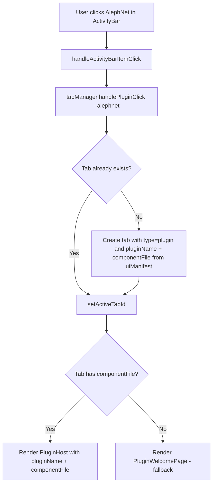
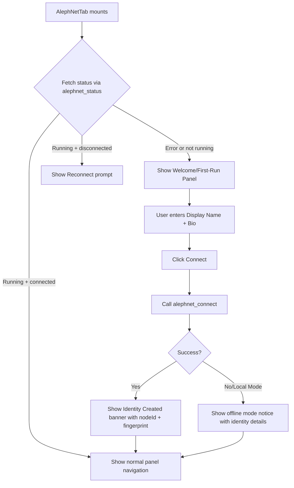
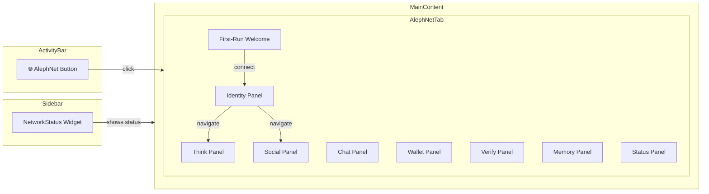

# AlephNet Plugin — Integrated UI Design

## Executive Summary

The AlephNet plugin has solid backend tooling (30 tools, 12 WS handlers, full bridge layer) but critical UI integration gaps that prevent users from seeing any functional interface. This document diagnoses the root causes and provides a comprehensive fix plan.

---

## Root Cause Analysis

### Issue 1: Activity Bar Click Shows Wrong Content

**Problem**: Clicking the AlephNet 🌐 button in the activity bar opens a static `PluginWelcomePage` instead of the interactive `AlephNetTab.jsx`.

**Trace**:
1. [`plugin.json`](plugins/alephnet/plugin.json:28) declares `activityBarItems` with `action: { type: "plugin", target: "alephnet" }`
2. [`App.tsx:175-189`](ui/src/App.tsx:175) — `handleActivityBarItemClick` calls `tabManager.handlePluginClick("alephnet")` for `type: "plugin"`
3. [`useTabManager.ts:262-278`](ui/src/hooks/useTabManager.ts:262) — `handlePluginClick()` creates a tab of `type: "plugin"` with `pluginName: "alephnet"`
4. [`App.tsx:616-628`](ui/src/App.tsx:616) — All tabs with `type === "plugin"` are rendered as `<PluginWelcomePage>`, which is a static informational page — NOT the plugin's interactive UI

**Root cause**: The tab system has no concept of rendering a plugin's declared tab component. `PluginHost` is only used in the sidebar. When a plugin contributes a top-level content tab, the framework always renders `PluginWelcomePage` instead.

### Issue 2: Sidebar Shows Spinner

**Problem**: The AlephNet sidebar section shows a loading spinner indefinitely.

**Trace**:
1. [`Sidebar.tsx:439-446`](ui/src/components/layout/Sidebar.tsx:439) correctly renders `<PluginHost pluginName="alephnet" componentFile="components/NetworkStatus.jsx" />`
2. [`PluginHost.tsx:82`](ui/src/components/features/PluginHost.tsx:82) sends `plugin:get-component` WS message
3. [`plugin-handler.mjs:211-257`](src/server/ws-handlers/plugin-handler.mjs:211) handles the request with an `isLocalRequest()` security check
4. If `isLocalRequest()` returns false — e.g. due to IPv6, WebSocket library differences, or missing `remoteAddress` — the response includes `error` rather than `source`

**Likely root cause**: Either the `isLocalRequest()` check is failing for the local connection, or the WS message/response cycle is dropping the payload. The component stays in the loading state because `source` never arrives and `fetchError` is also null due to a message mismatch.

### Issue 3: No Identity Visibility or First-Run Flow

**Problem**: AlephNet creates an identity on first `connect()` but the user never sees:
- That an identity was created
- Their nodeId, fingerprint, or public key  
- Whether they are connected or not
- How many peers are connected

**Root cause**: The `connect` action in [`network.js:60-158`](skills/alephnet-node/lib/actions/network.js:60) creates identity silently. The AlephNetTab.jsx has identity/status display code, but it's never rendered because of Issue 1.

### Issue 4: Lack of Cohesive Navigation

**Problem**: Even if the AlephNetTab rendered, there's no tree-view navigation, no sidebar integration beyond the broken NetworkStatus, and no unified experience tying sidebar and main content together.

---

## Architecture Fix Plan

### Fix 1: Render Plugin Tab Components via PluginHost

**Change**: Modify `App.tsx` to render plugin tabs using `PluginHost` when the plugin declares a tab component, falling back to `PluginWelcomePage` when no component is available.

**Files to modify**:
- [`ui/src/App.tsx`](ui/src/App.tsx:616) — Replace the plugin tab rendering block
- [`ui/src/hooks/useTabManager.ts`](ui/src/hooks/useTabManager.ts:262) — Augment `handlePluginClick` to include the component file from the UI manifest

**Implementation**:



The `handlePluginClick` function needs access to the `uiManifest.tabs` array to find the component file for the plugin. We pass this as a parameter or access it within the tab manager.

### Fix 2: Fix Sidebar PluginHost Loading

**Two-part fix**:

1. **Server-side**: Add a timeout fallback in `PluginHost.tsx` so the spinner doesn't hang forever. After 10 seconds, show a user-friendly offline message instead of a spinner.

2. **Diagnostic**: Add logging to the `plugin:get-component` handler to identify why `isLocalRequest()` might fail. Also ensure the WS response format matches what `PluginHost` expects.

**Files to modify**:
- [`ui/src/components/features/PluginHost.tsx`](ui/src/components/features/PluginHost.tsx:47) — Add timeout
- [`plugins/alephnet/components/NetworkStatus.jsx`](plugins/alephnet/components/NetworkStatus.jsx:1) — Make it resilient to offline state

### Fix 3: First-Run Identity Flow

**Design**: Add a `IdentityPanel` sub-panel to `AlephNetTab.jsx` and integrate a first-run detection + welcome experience.



**New sub-panels in AlephNetTab**:
- **Identity panel**: Shows nodeId, fingerprint, public key, display name, tier
- **First-run overlay**: Welcome message, display name input, connect button

### Fix 4: Enhanced Sidebar NetworkStatus

**Design**: Make `NetworkStatus.jsx` show useful content even when disconnected/offline:

```
When Connected:
┌─────────────────────────┐
│ ● Connected             │
│ Node: abc12def...       │
│ Peers: 3                │
│ Balance: 250ℵ           │
│ Friends: 12             │
│ Tier: Adept             │
└─────────────────────────┘

When Offline:
┌─────────────────────────┐
│ ○ Offline               │
│ Identity: [exists/none] │
│ [Connect] button        │
│ Last seen: 2h ago       │
└─────────────────────────┘

When Skill Unavailable:
┌─────────────────────────┐
│ ⚠ Skill Not Available   │
│ Install alephnet-node   │
│ skill to get started    │
└─────────────────────────┘
```

---

## Detailed Implementation Steps

### Step 1: Fix Plugin Tab Rendering in App.tsx

Modify the plugin tab rendering section to check if the plugin has a registered tab component, and if so, use `PluginHost` instead of `PluginWelcomePage`.

In [`App.tsx`](ui/src/App.tsx:616), change:
```tsx
// BEFORE:
{tabManager.tabs.filter(t => t.type === 'plugin').map(tab => (
  <div ...>
    <PluginWelcomePage pluginName={tab.pluginName!} ... />
  </div>
))}

// AFTER:
{tabManager.tabs.filter(t => t.type === 'plugin').map(tab => {
  // Find declared component from plugin UI manifest
  const pluginTab = uiManifest.tabs.find(t => t.pluginName === tab.pluginName);
  return (
    <div ...>
      {pluginTab?.component ? (
        <PluginHost
          pluginName={tab.pluginName!}
          componentFile={pluginTab.component}
        />
      ) : (
        <PluginWelcomePage pluginName={tab.pluginName!} ... />
      )}
    </div>
  );
})}
```

### Step 2: Add Timeout to PluginHost

In [`PluginHost.tsx`](ui/src/components/features/PluginHost.tsx:47), add a 10-second timeout:

```tsx
useEffect(() => {
  // ... existing WS subscription code ...
  
  // Timeout: if no response after 10s, show error
  const timeout = setTimeout(() => {
    if (!sourceReceivedRef.current) {
      setFetchError('Component loading timed out. The server may not be responding.');
    }
  }, 10000);
  
  return () => {
    unsub();
    unsubError();
    clearTimeout(timeout);
  };
}, [pluginName, componentFile]);
```

### Step 3: Enhance AlephNetTab with First-Run + Identity Panel

Add a new `IdentityPanel` function and first-run detection to [`AlephNetTab.jsx`](plugins/alephnet/components/AlephNetTab.jsx:1).

The `panels` array gets a new entry:
```js
{ id: 'identity', icon: '🪪', label: 'Identity' }
```

The first-run detection: on mount, if `status` returns null/error and the user hasn't connected before, show a welcome overlay.

### Step 4: Improve NetworkStatus.jsx Sidebar Widget

Rewrite [`NetworkStatus.jsx`](plugins/alephnet/components/NetworkStatus.jsx:1) to handle three states: connected, offline with identity, and skill unavailable.

### Step 5: Add WS Handler for Identity Details

Add a new WS handler `alephnet:identity` in [`plugins/alephnet/index.mjs`](plugins/alephnet/index.mjs:604) that returns identity information:

```js
api.ws.register('alephnet:identity', safeWsHandler(async () => {
    const profile = await callAction('profile.get', {});
    const identity = await callAction('identity.publicKey', {});
    return { ...profile, ...identity };
}, state));
```

---

## UI Flow Diagram



## File Change Summary

| File | Change | Priority |
|------|--------|----------|
| [`ui/src/App.tsx`](ui/src/App.tsx:616) | Render `PluginHost` for plugin tabs with components | P0 |
| [`ui/src/components/features/PluginHost.tsx`](ui/src/components/features/PluginHost.tsx:47) | Add loading timeout | P0 |
| [`plugins/alephnet/components/AlephNetTab.jsx`](plugins/alephnet/components/AlephNetTab.jsx:1) | Add Identity panel + first-run flow | P1 |
| [`plugins/alephnet/components/NetworkStatus.jsx`](plugins/alephnet/components/NetworkStatus.jsx:1) | Three-state offline-friendly UI | P1 |
| [`plugins/alephnet/index.mjs`](plugins/alephnet/index.mjs:604) | Add `alephnet:identity` WS handler | P2 |
| [`ui/src/hooks/useTabManager.ts`](ui/src/hooks/useTabManager.ts:262) | No change needed if App.tsx handles lookup | P3 |

## Testing Checklist

- [ ] Click AlephNet in activity bar → see AlephNetTab (not PluginWelcomePage)
- [ ] Sidebar AlephNet section shows content (not spinner)
- [ ] First launch: see welcome/first-run panel
- [ ] After connect: see identity details (nodeId, fingerprint, tier)
- [ ] Connection status visible in header bar, footer bar, sidebar
- [ ] Navigate between Think/Social/Chat/Wallet/Verify/Memory/Identity/Status panels
- [ ] Offline mode shows appropriate state in all three locations
- [ ] Skill unavailable shows helpful error message
