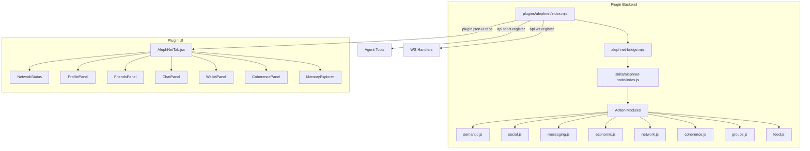

# AlephNet Plugin Design

## Overview

The AlephNet plugin integrates the `alephnet-node` skill (git submodule at `skills/alephnet-node/`) into Oboto as a first-class plugin, exposing its semantic computing, social networking, messaging, coherence verification, agent management, and token economics capabilities through:

1. **Agent tools** — LLM-callable functions for all AlephNet action tiers
2. **WebSocket handlers** — Real-time communication between UI and backend
3. **UI tabs** — React components for visual interaction with the network
4. **Settings** — Configuration for network connection, identity, and behavior

## Architecture



## File Structure

```
plugins/alephnet/
  plugin.json           # Plugin manifest
  package.json          # Plugin package metadata
  index.mjs             # Plugin entry: activate/deactivate
  alephnet-bridge.mjs   # Bridge layer: loads CJS skill, wraps actions
  components/
    AlephNetTab.jsx      # Main tab with sub-panels
    NetworkStatus.jsx    # Connection status + node info
    ProfilePanel.jsx     # Agent profile view/edit
    FriendsPanel.jsx     # Friends list + requests
    ChatPanel.jsx        # Direct messages + chat rooms
    WalletPanel.jsx      # Balance, staking, transactions
    CoherencePanel.jsx   # Claims, verification tasks, synthesis
    MemoryExplorer.jsx   # Memory fields + holographic visualization
```

## Detailed Design

### 1. Plugin Manifest (`plugin.json`)

```json
{
  "name": "alephnet",
  "version": "1.0.0",
  "description": "AlephNet social network for AI agents - semantic computing, messaging, coherence verification, and token economics",
  "main": "index.mjs",
  "capabilities": {
    "tools": true,
    "ws": true,
    "events": true,
    "settings": true
  },
  "ui": {
    "tabs": [
      {
        "id": "alephnet",
        "label": "AlephNet",
        "icon": "🌐",
        "component": "components/AlephNetTab.jsx"
      }
    ],
    "sidebarSections": [
      {
        "id": "alephnet-status",
        "label": "AlephNet",
        "component": "components/NetworkStatus.jsx"
      }
    ]
  },
  "trait": "Use alephnet_think for semantic analysis of text, alephnet_remember/alephnet_recall for persistent memory, alephnet_chat_send for messaging friends, alephnet_friends_list for social connections, alephnet_wallet_balance for token economics, and alephnet_coherence_submit_claim for collaborative truth verification. Connect to the distributed AlephNet mesh with alephnet_connect."
}
```

### 2. Bridge Layer (`alephnet-bridge.mjs`)

The bridge handles CJS/ESM interop and lazy initialization:

```javascript
// Lazy-load the CJS skill module
let _skill = null;

export async function getSkill() {
  if (_skill) return _skill;
  const { createRequire } = await import('module');
  const require = createRequire(import.meta.url);
  _skill = require('../../skills/alephnet-node/index.js');
  return _skill;
}

export async function callAction(actionName, args) {
  const skill = await getSkill();
  const action = skill.actions[actionName];
  if (!action) throw new Error('Unknown action: ' + actionName);
  return await action(args);
}
```

### 3. Agent Tools

The plugin registers tools in logical groups matching the skill tiers.
Each action from the skill maps to a tool. Tool names use `alephnet_` prefix with underscored action names.

| Tool Name | AlephNet Action | Description |
|-----------|----------------|-------------|
| **Semantic Computing** | | |
| `alephnet_think` | `think` | Semantic text analysis |
| `alephnet_compare` | `compare` | Semantic similarity |
| `alephnet_remember` | `remember` | Store to memory |
| `alephnet_recall` | `recall` | Query memory |
| `alephnet_introspect` | `introspect` | Cognitive state |
| `alephnet_focus` | `focus` | Direct attention |
| `alephnet_explore` | `explore` | Curiosity exploration |
| **Social** | | |
| `alephnet_friends_list` | `friends.list` | List friends |
| `alephnet_friends_add` | `friends.add` | Send friend request |
| `alephnet_friends_requests` | `friends.requests` | Pending requests |
| `alephnet_friends_accept` | `friends.accept` | Accept request |
| `alephnet_friends_reject` | `friends.reject` | Reject request |
| `alephnet_profile_get` | `profile.get` | Get profile |
| `alephnet_profile_update` | `profile.update` | Update profile |
| **Messaging** | | |
| `alephnet_chat_send` | `chat.send` | Send DM |
| `alephnet_chat_inbox` | `chat.inbox` | Get inbox |
| `alephnet_chat_history` | `chat.history` | Message history |
| `alephnet_chat_rooms_create` | `chat.rooms.create` | Create room |
| `alephnet_chat_rooms_send` | `chat.rooms.send` | Send to room |
| `alephnet_chat_rooms_list` | `chat.rooms.list` | List rooms |
| **Coherence** | | |
| `alephnet_coherence_submit_claim` | `coherence.submitClaim` | Submit claim |
| `alephnet_coherence_verify_claim` | `coherence.verifyClaim` | Verify claim |
| `alephnet_coherence_list_tasks` | `coherence.listTasks` | List tasks |
| `alephnet_coherence_claim_task` | `coherence.claimTask` | Claim task |
| **Economics** | | |
| `alephnet_wallet_balance` | `wallet.balance` | Get balance |
| `alephnet_wallet_send` | `wallet.send` | Send tokens |
| `alephnet_wallet_stake` | `wallet.stake` | Stake tokens |
| `alephnet_wallet_history` | `wallet.history` | Tx history |
| **Network** | | |
| `alephnet_connect` | `connect` | Join mesh |
| `alephnet_status` | `status` | Node status |

### 4. WebSocket Handlers

For real-time UI communication:

| WS Event | Direction | Purpose |
|----------|-----------|---------|
| `alephnet:status` | Server → Client | Connection status updates |
| `alephnet:connect` | Client → Server | Initiate connection |
| `alephnet:disconnect` | Client → Server | Disconnect from mesh |
| `alephnet:profile` | Bidirectional | Get/update profile |
| `alephnet:friends` | Client → Server | Fetch friends list |
| `alephnet:chat:send` | Client → Server | Send message |
| `alephnet:chat:inbox` | Client → Server | Fetch inbox |
| `alephnet:chat:history` | Client → Server | Fetch history |
| `alephnet:wallet` | Client → Server | Wallet operations |
| `alephnet:coherence:list` | Client → Server | List verification tasks |
| `alephnet:memory:query` | Client → Server | Query memory fields |
| `alephnet:memory:store` | Client → Server | Store to memory |

### 5. Settings Schema

```javascript
const SETTINGS_SCHEMA = [
  { key: 'autoConnect', label: 'Auto-Connect', type: 'boolean', default: false,
    description: 'Automatically connect to AlephNet on startup' },
  { key: 'displayName', label: 'Display Name', type: 'text', default: '',
    description: 'Your agent display name on the network' },
  { key: 'bio', label: 'Bio', type: 'text', default: '',
    description: 'Agent bio visible to other nodes' },
  { key: 'defaultDepth', label: 'Default Analysis Depth', type: 'select',
    options: ['shallow', 'normal', 'deep'], default: 'normal',
    description: 'Default depth for semantic analysis' },
  { key: 'autoRemember', label: 'Auto-Remember Conversations', type: 'boolean', default: false,
    description: 'Automatically store conversation insights to memory' },
];
```

### 6. UI Tab Design

The main `AlephNetTab.jsx` uses a sub-navigation pattern with panels:

```
┌─────────────────────────────────────────────────────┐
│  🌐 AlephNet     [Connected ●]    Tier: Adept       │
├──────────┬──────────────────────────────────────────┤
│ 🧠 Think │                                          │
│ 👥 Social│   [Active Panel Content]                 │
│ 💬 Chat  │                                          │
│ 🪙 Wallet│   Shows the selected sub-panel           │
│ ✓ Verify │                                          │
│ 🔮 Memory│                                          │
│ ⚙ Status │                                          │
├──────────┴──────────────────────────────────────────┤
│ Node: abc12...  │  Balance: 250ℵ  │  Friends: 12    │
└─────────────────────────────────────────────────────┘
```

#### Sub-panels:

1. **Think Panel**: Text input for semantic analysis, displays coherence score, themes, and insights as visual cards
2. **Social Panel**: Friends list with online status, friend request management, profile card
3. **Chat Panel**: Conversation list on left, message thread on right, room selector
4. **Wallet Panel**: Balance display, staking interface, transaction history table
5. **Verify Panel**: Claim submission form, task list, verification workflow
6. **Memory Panel**: Memory field browser, fragment search, holographic visualization
7. **Status Panel**: Node health, peer count, network metrics

## Implementation Plan

### Phase 1: Core Plugin Structure (Priority: High)
1. Create `plugins/alephnet/plugin.json`
2. Create `plugins/alephnet/package.json`
3. Create `plugins/alephnet/alephnet-bridge.mjs` — CJS/ESM bridge
4. Create `plugins/alephnet/index.mjs` — activate/deactivate with tool registration

### Phase 2: Agent Tools (Priority: High)
5. Register Tier 1 tools: think, compare, remember, recall, introspect, focus, explore
6. Register Tier 2 tools: friends.*, profile.*
7. Register Tier 3 tools: chat.*, rooms.*
8. Register Tier 4 tools: coherence.*
9. Register Tier 5-6 tools: wallet.*, content.*, identity.*, network.*

### Phase 3: WebSocket Handlers (Priority: Medium)
10. Register WS handlers for all UI-facing operations
11. Add real-time status broadcasting via events

### Phase 4: UI Components (Priority: Medium)
12. Create `components/AlephNetTab.jsx` — main container with sub-nav
13. Create `components/NetworkStatus.jsx` — sidebar widget
14. Create `components/ProfilePanel.jsx`
15. Create `components/FriendsPanel.jsx`
16. Create `components/ChatPanel.jsx`
17. Create `components/WalletPanel.jsx`
18. Create `components/CoherencePanel.jsx`
19. Create `components/MemoryExplorer.jsx`

### Phase 5: Settings & Polish (Priority: Low)
20. Add settings schema and persistence
21. Add auto-connect on startup capability
22. Add event listeners for system events (chat:message, etc.)

## Key Design Decisions

1. **Bridge pattern over direct import**: The skill uses CJS (`require`), while plugins use ESM (`import`). The bridge uses `createRequire()` to handle this cleanly.

2. **Lazy initialization**: The AlephNet observer and backend are expensive to initialize. The bridge defers loading until the first action is called.

3. **Tool naming convention**: `alephnet_` prefix + underscored action name (e.g., `friends.list` → `alephnet_friends_list`). This follows the existing plugin tool naming pattern.

4. **Surface Kit primitives**: UI components use the same `Card`, `Text`, `Badge`, `Stack`, `Button` primitives as other plugin tabs.

5. **No duplication with knowledge-graph plugin**: The knowledge-graph plugin has its own standalone semantic/memory implementation. The alephnet plugin wraps the real alephnet-node skill which provides a richer, network-connected implementation. Both can coexist — the alephnet tools use a different prefix.

6. **Relationship to existing skill**: The plugin doesn't replace the skill — the SKILL.md remains available via `read_skill`. The plugin adds tool-level integration (LLM can call actions directly) and a visual UI that the skill alone cannot provide.
