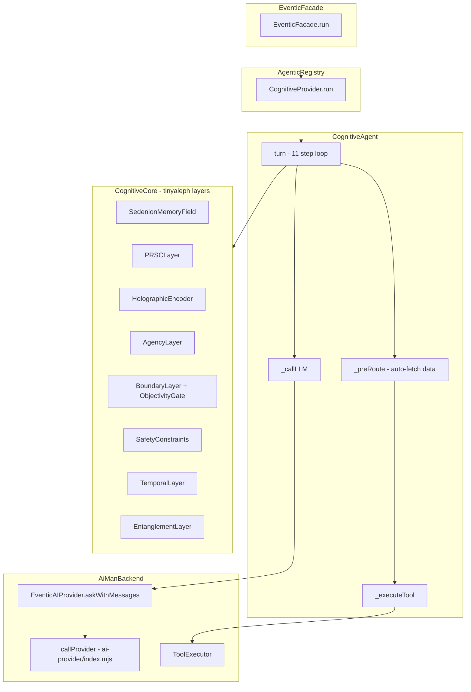
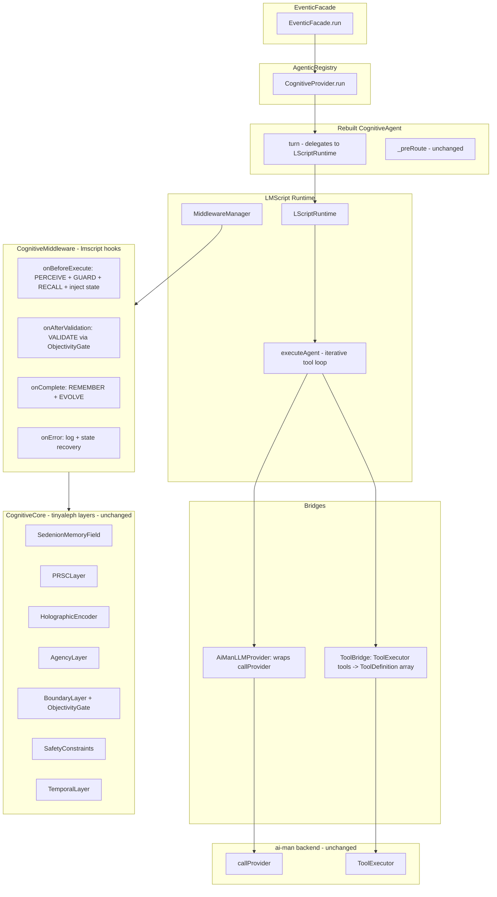
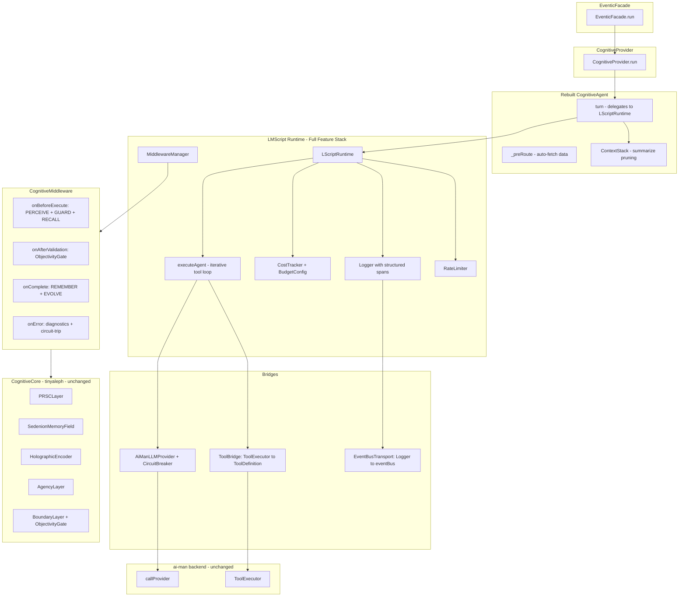

# Rebuild Cognitive Agent with LMScript

## Goal

Replace the hand-rolled agent loop in `CognitiveAgent.turn()` with lmscript's `LScriptRuntime.executeAgent()` / `AgentLoop`, while keeping the tinyaleph cognitive layers (PRSC, SMF, holographic memory, safety constraints) wired in as lmscript middleware hooks.

## Current Architecture



### Current Flow in `CognitiveAgent.turn()`

1. **PERCEIVE/ENCODE/ORIENT/ATTEND** — `cognitive.processInput(input)` — tinyaleph layers
2. **GUARD** — `cognitive.checkSafety()` — tinyaleph safety constraints
3. **RECALL** — `cognitive.recall(input, 3)` — holographic memory retrieval
4. **Build system prompt** — merges facade dynamic prompt + cognitive state + tool names + memories
5. **Pre-route** — `_preRoute()` auto-fetches files/cognitive state
6. **THINK/EXECUTE** — Hand-rolled loop:
   - `_callLLM()` → `EventicAIProvider.askWithMessages()`
   - While toolCalls and rounds < maxToolRounds: execute tools, push results, call LLM again
   - Synthesis fallback if loop exhausts without text
7. **VALIDATE** — `cognitive.validateOutput()` — ObjectivityGate
8. **REMEMBER** — `cognitive.remember()` — holographic memory store
9. **EVOLVE** — `cognitive.tick()` — advance physics

## Target Architecture



## Components to Build

### 1. Install `@sschepis/lmscript`

Add to `package.json` dependencies. Since the library is at `~/Development/lmscript`, it can be:
- Linked via `pnpm link` during development
- Added as `"@sschepis/lmscript": "workspace:*"` if added to `pnpm-workspace.yaml`
- Published to npm and referenced normally

Recommended: Add `../lmscript` to `pnpm-workspace.yaml` and use `workspace:*` for development.

### 2. `AiManLLMProvider` — Bridge ai-man's provider to lmscript's `LLMProvider` interface

**File:** `src/core/agentic/cognitive/lmscript-provider.mjs`

This adapter implements lmscript's `LLMProvider` interface by delegating to ai-man's existing `callProvider()` function:

```javascript
// Implements: { name: string, chat(request: LLMRequest): Promise<LLMResponse> }
class AiManLLMProvider {
  get name() { return 'ai-man'; }

  async chat(request) {
    // Convert LLMRequest → ai-man requestBody format
    // Call callProvider()
    // Convert response → LLMResponse format
  }
}
```

**Key mapping:**
| lmscript `LLMRequest`         | ai-man `callProvider` requestBody    |
| ----------------------------- | ------------------------------------ |
| `request.model`               | `requestBody.model`                  |
| `request.messages`            | `requestBody.messages`               |
| `request.temperature`         | `requestBody.temperature`            |
| `request.jsonMode`            | `requestBody.response_format`        |
| `request.jsonSchema`          | `requestBody.response_format.json_schema` |
| `request.tools`               | `requestBody.tools` (needs format conversion) |

**Response mapping:**
| ai-man response               | lmscript `LLMResponse`               |
| ----------------------------- | ------------------------------------- |
| `response.choices[0].message.content` | `content`                       |
| `response.usage`              | `usage` (field names match)           |
| `response.choices[0].message.tool_calls` | `toolCalls` (reformat id/name/arguments) |

### 3. `ToolBridge` — Convert ai-man ToolExecutor tools to lmscript `ToolDefinition` objects

**File:** `src/core/agentic/cognitive/tool-bridge.mjs`

ai-man's `ToolExecutor.getAllToolDefinitions()` returns OpenAI function-calling format:
```javascript
{ type: 'function', function: { name, description, parameters: JSONSchema } }
```

lmscript's `ToolDefinition` expects:
```javascript
{ name, description, parameters: ZodSchema, execute: (params) => result }
```

The bridge must:
1. Convert JSON Schema parameters to a passthrough Zod schema (since strict validation isn't needed — the LLM produces the args)
2. Wrap `ToolExecutor.executeTool()` as the `execute` function
3. Include the cognitive-specific tools (cognitive_state, recall_memory) directly

### 4. `CognitiveMiddleware` — Wire tinyaleph layers into lmscript lifecycle

**File:** `src/core/agentic/cognitive/cognitive-middleware.mjs`

Implements lmscript's `MiddlewareHooks`:

```javascript
{
  onBeforeExecute(ctx) {
    // Step 1-4: PERCEIVE/ENCODE/ORIENT/ATTEND
    const inputAnalysis = cognitive.processInput(userInput);

    // Step 5: GUARD — safety check
    const violations = cognitive.checkSafety();
    if (blocked) throw new SafetyBlockError();

    // Step 6: RECALL — memory retrieval
    const memories = cognitive.recall(userInput, 3);

    // Inject cognitive state + memories into system message
    // Modify ctx.messages to include cognitive context
  },

  onAfterValidation(ctx, result) {
    // Step 9: VALIDATE — ObjectivityGate
    const validation = cognitive.validateOutput(result, ctx);
    // Annotate result if below threshold
  },

  onComplete(ctx, result) {
    // Step 10: REMEMBER — store in holographic memory
    cognitive.remember(input, response);

    // Step 11: EVOLVE — tick physics
    cognitive.tick(); cognitive.tick(); cognitive.tick();
  },

  onError(ctx, error) {
    // Log error with cognitive state for diagnostics
  }
}
```

### 5. `LScriptFunction` definition for the agent turn

**File:** Updated in `src/core/agentic/cognitive/agent.mjs`

Define the agent's conversation turn as an `LScriptFunction`:

```javascript
const agentTurnFn = {
  name: 'CognitiveAgentTurn',
  model: this.aiProvider.model,
  system: dynamicSystemPrompt,  // built from facade + cognitive state
  prompt: (input) => input,     // user message is the prompt
  schema: z.object({
    response: z.string(),       // the agent's text response
  }),
  temperature: 0.7,
  maxRetries: 2,
  tools: toolBridge.getToolDefinitions(),
};
```

**Important design decision:** The current agent produces free-text responses, not structured JSON. Two options:

- **Option A:** Use a minimal schema `z.object({ response: z.string() })` and extract `.response`
- **Option B:** Use lmscript's `executeAgent()` which validates the *final* response against the schema, allowing free-text tool rounds in between

**Recommendation:** Option B is better — it matches the current behavior where the agent freely uses tools and then produces a final response. The schema validation ensures we get structured output at the end.

However, the current agent produces **raw text**, not JSON. We need either:
- A schema like `z.string()` (but lmscript requires JSON output)
- A wrapper schema `z.object({ response: z.string() })` with a system prompt that says "wrap your response in JSON"
- Or modify lmscript to support a text-only mode (out of scope)

**Practical approach:** Use the wrapper schema. The system prompt already instructs the model, and lmscript handles the JSON enforcement + validation.

### 6. Rebuilt `CognitiveAgent.turn()`

The new `turn()` method becomes much simpler:

```javascript
async turn(input, options = {}) {
  this.turnCount++;

  // Pre-route for auto-fetching (kept as-is)
  const preRouted = await this._preRoute(input);
  const preRouteContext = this._buildPreRouteContext(preRouted);

  // Build the LScriptFunction dynamically per-turn
  const turnFn = this._buildTurnFunction(input, preRouteContext);

  // Execute through lmscript's agent loop
  const result = await this.runtime.executeAgent(turnFn, input, {
    maxIterations: this.config.agent.maxToolRounds + 1,
    onToolCall: (tc) => {
      emitToolStatus(tc.name, 'executing');
    },
    onIteration: (iter, response) => {
      emitStatus(`Thinking... round ${iter}`);
    }
  });

  return {
    response: result.data.response,
    metadata: {
      provider: 'cognitive',
      turnCount: this.turnCount,
      toolsUsed: result.toolCalls.map(tc => tc.name),
      toolRounds: result.iterations,
      ...this._getCognitiveMetadata()
    }
  };
}
```

### 7. Update `CognitiveProvider`

Minimal changes — the provider interface (`run()`) stays the same. The `initialize()` method needs to create the `LScriptRuntime` and register middleware.

## File Change Summary

| File | Action | Description |
|------|--------|-------------|
| `package.json` | Modify | Add `@sschepis/lmscript` dependency |
| `pnpm-workspace.yaml` | Modify | Add `../lmscript` for workspace linking |
| `src/core/agentic/cognitive/lmscript-provider.mjs` | Create | `AiManLLMProvider` bridge |
| `src/core/agentic/cognitive/tool-bridge.mjs` | Create | ToolExecutor → ToolDefinition bridge |
| `src/core/agentic/cognitive/cognitive-middleware.mjs` | Create | tinyaleph layers as lmscript middleware |
| `src/core/agentic/cognitive/agent.mjs` | Rewrite | Use LScriptRuntime.executeAgent |
| `src/core/agentic/cognitive-provider.mjs` | Modify | Create LScriptRuntime in initialize |
| `src/core/agentic/cognitive/config.mjs` | Modify | Add lmscript-specific config options |

## Risk Mitigation

1. **Backwards compatibility:** The `CognitiveProvider` API (`run()`) is unchanged — `EventicFacade` and all callers are unaffected.

2. **Fallback:** If lmscript import fails, fall back to the existing hand-rolled loop (the current code can be kept as `_turnLegacy()`).

3. **Response format:** The current agent outputs raw text; lmscript requires JSON. The wrapper schema `{ response: string }` handles this transparently.

4. **Tool format mismatch:** ai-man uses OpenAI function-calling format; lmscript uses `{ name, description, parameters: ZodSchema, execute }`. The `ToolBridge` handles conversion.

5. **Streaming:** lmscript's `executeAgent` doesn't stream mid-response. The `CognitiveProvider.run()` already handles streaming by emitting the full response as a single chunk — this behavior is preserved.

## Enhancements — Taking Advantage of Full lmscript Feature Set

Beyond the core replacement, integrating lmscript unlocks several capabilities the hand-rolled loop cannot provide. These should be built in from the start:

### Enhancement 1: Context Window Management via ContextStack

**Problem:** The current agent uses a naive `while (history.length > maxHistory)` trim that drops oldest messages regardless of importance.

**Solution:** Use lmscript's `ContextStack` with `summarize` pruning strategy:

```javascript
const contextStack = new ContextStack({
  maxTokens: 120000,  // model-dependent, configurable
  pruneStrategy: 'summarize',
});

// Wire the summarizer to the LLM itself
contextStack.setSummarizer(async (messages) => {
  const summaryFn = { /* LScriptFunction for summarization */ };
  const result = await runtime.execute(summaryFn, messages);
  return result.data.summary;
});
```

Old conversation history gets **summarized** instead of discarded — the agent retains semantic context across longer conversations. The `ContextStack` handles token counting and pruning automatically.

**Integration point:** Replace `this.history` array in `CognitiveAgent` with a `ContextStack`. Use `runtime.createSession()` to get a session with managed context.

### Enhancement 2: Cost Tracking and Budget Controls

**Problem:** The current agent has no token usage tracking or budget limits. A runaway tool loop can consume unlimited API tokens.

**Solution:** Wire lmscript's `CostTracker` and `BudgetConfig` into the runtime:

```javascript
const costTracker = new CostTracker();
const runtime = new LScriptRuntime({
  provider: aiManProvider,
  costTracker,
  budget: {
    maxTotalTokens: 500000,        // per-session limit
    maxTokensPerExecution: 50000,  // per-turn limit
  },
});
```

Expose cost data through `getStats()` so the UI can show token usage. The `BudgetExceededError` gracefully stops execution when limits are hit.

### Enhancement 3: Circuit Breaker for LLM Provider Resilience

**Problem:** The current agent has a manual retry mechanism in `withRetry()` but no circuit-breaking. If the LLM provider is down, every request attempts the full retry chain.

**Solution:** Wrap the `AiManLLMProvider` with lmscript's `CircuitBreaker`:

```javascript
const breaker = new CircuitBreaker({
  failureThreshold: 3,   // trip after 3 consecutive failures
  resetTimeout: 30000,   // try again after 30s
  successThreshold: 2,   // 2 successes to fully close
});
```

Integrate into the `AiManLLMProvider.chat()` method so failed LLM calls trip the breaker and subsequent requests fail fast with a clear "provider unavailable" message instead of hanging for full timeout chains.

### Enhancement 4: Structured Logging via lmscript Logger

**Problem:** The current agent uses scattered `emitStatus()` calls and `console.log` for observability. There's no structured trace of execution flow.

**Solution:** Use lmscript's `Logger` with spans:

```javascript
const logger = new Logger({
  level: LogLevel.INFO,
  transports: [new ConsoleTransport()],
});

// In middleware:
const span = logger.startSpan('cognitive-turn');
span.log(LogLevel.INFO, 'PERCEIVE phase', { coherence, entropy });
// ...
span.end();
```

The logger provides structured, span-scoped execution traces. This can be wired to ai-man's `eventBus` for real-time UI telemetry via a custom `LogTransport`.

### Enhancement 5: Cognitive-Aware Model Routing

**Problem:** The current agent always uses the same model. There's no way to route different types of queries to different models based on cognitive state.

**Solution:** Use lmscript's `ModelRouter` to route based on cognitive state:

```javascript
const router = new ModelRouter({
  rules: [
    {
      // High-coherence analytical tasks -> cheaper/faster model
      match: fn => fn.name.includes('CognitiveAgentTurn') && cognitiveState.coherence > 0.8,
      provider: fastModelProvider,
      modelOverride: 'gpt-4o-mini',
    },
    {
      // Low-coherence complex reasoning -> premium model
      match: fn => fn.name.includes('CognitiveAgentTurn') && cognitiveState.coherence < 0.3,
      provider: premiumProvider,
      modelOverride: 'claude-sonnet-4-20250514',
    },
  ],
  defaultProvider: aiManProvider,
});
```

This allows the tinyaleph cognitive state to *influence which model handles the request* — a unique capability that emerges from combining the two libraries.

### Enhancement 6: Rate Limiting

**Problem:** No rate limiting on LLM calls. Rapid-fire user input can overwhelm API quotas.

**Solution:** Use lmscript's `RateLimiter`:

```javascript
const rateLimiter = new RateLimiter({
  maxRequestsPerMinute: 30,
  maxTokensPerMinute: 100000,
});
```

Wire into the runtime — calls automatically queue when limits are approached.

### Enhancement 7: EventBus Log Transport

**Problem:** lmscript's structured Logger produces rich execution traces, but they're disconnected from ai-man's `eventBus` which drives the UI.

**Solution:** Create a custom `LogTransport` that bridges lmscript Logger events to ai-man's eventBus:

```javascript
class EventBusTransport {
  constructor(eventBus) { this.eventBus = eventBus; }

  log(entry) {
    this.eventBus.emitTyped('cognitive:log', {
      level: entry.level,
      message: entry.message,
      span: entry.spanId,
      timestamp: entry.timestamp,
      metadata: entry.metadata,
    });
  }
}
```

This gives the UI real-time visibility into the cognitive agent's execution flow with structured metadata.

## Enhanced Architecture Diagram



## File Change Summary (Updated with Enhancements)

| File | Action | Description |
|------|--------|-------------|
| `package.json` | Modify | Add `@sschepis/lmscript` dependency |
| `pnpm-workspace.yaml` | Modify | Add `../lmscript` for workspace linking |
| `src/core/agentic/cognitive/lmscript-provider.mjs` | Create | `AiManLLMProvider` bridge with CircuitBreaker |
| `src/core/agentic/cognitive/tool-bridge.mjs` | Create | ToolExecutor to ToolDefinition bridge |
| `src/core/agentic/cognitive/cognitive-middleware.mjs` | Create | tinyaleph layers as lmscript middleware |
| `src/core/agentic/cognitive/eventbus-transport.mjs` | Create | EventBus LogTransport for UI telemetry |
| `src/core/agentic/cognitive/agent.mjs` | Rewrite | Use LScriptRuntime.executeAgent + ContextStack + CostTracker |
| `src/core/agentic/cognitive-provider.mjs` | Modify | Create LScriptRuntime with full feature stack |
| `src/core/agentic/cognitive/config.mjs` | Modify | Add lmscript-specific config: budget, rate limits, circuit breaker |

## Implementation Order

1. Install dependency + workspace link
2. `AiManLLMProvider` adapter with CircuitBreaker (isolated, testable)
3. `ToolBridge` (isolated, testable)
4. `EventBusTransport` for Logger (isolated, testable)
5. `CognitiveMiddleware` with structured Logger (depends on CognitiveCore, testable in isolation)
6. Rebuild `CognitiveAgent.turn()` with ContextStack, CostTracker, RateLimiter (integrates all above)
7. Update `CognitiveProvider.initialize()` (wire everything together)
8. Add cognitive-aware ModelRouter (optional, can be deferred)
9. Unit tests for each bridge component
10. Integration testing

## Phase 2 Enhancements (Post-Stabilization)

- Multi-step Pipeline decomposition of the 11-step loop into separate `LScriptFunction` steps
- Prompt A/B testing via `PromptRegistry` for system prompt variations
- RAG Pipeline integration for long-term memory beyond holographic encoder
- `FallbackProvider` to cascade across multiple LLM providers with circuit breakers
