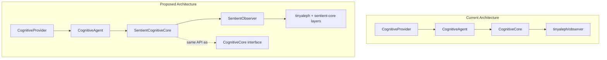
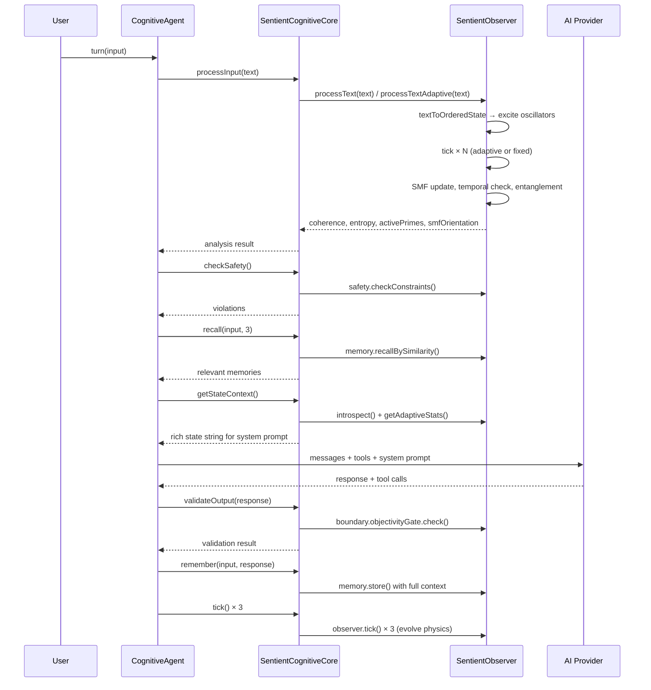

# Sentient Observer Integration into Cognitive Agent Provider

## Executive Summary

This document proposes integrating the AlephNet **SentientObserver** (from `skills/alephnet-node/lib/sentient-core.js`) as an extended cognitive substrate for the **CognitiveProvider** agent loop (at `src/core/agentic/cognitive-provider.mjs`). The goal is to replace the current lightweight `CognitiveCore` with the full SentientObserver, gaining its richer capabilities: continuous PRSC oscillator dynamics, holographic memory (HQE), temporal/entanglement layers, agency/boundary/safety layers, adaptive processing, and event-driven architecture.

---

## Architecture Comparison

### Current: CognitiveCore (lightweight)

```
CognitiveCore
├── PRSC (oscillator dynamics)
├── SMF (16D sedenion field)
├── HQE (holographic encoder — project only)
├── Agency (goals, attention)
├── Boundary (objectivity gate)
├── Temporal (force-moment only)
├── Entanglement (stub)
└── Safety (2 soft constraints)
```

- ~400 lines, manual tick loop
- No running background process
- Simple prime-hashing text encoding
- Memory: flat array with prime-overlap scoring
- No event system, no adaptive processing
- ObjectivityGate for output validation

### Target: SentientObserver (full)

```
SentientObserver
├── PRSC (full oscillator dynamics with coupling/damping)
├── SMF (16D sedenion memory field with entropy tracking)
├── HQE (holographic encoder with λ-stabilization, evolve())
├── Agency (goals, attention, metacognition, emotional valence)
├── Boundary (self-model, environmental model, I/O processing)
├── Safety (full constraint system with corrections)
├── Temporal (moment detection, pattern detection, coherence-triggered)
├── Entanglement (phrase detection, semantic binding)
├── SentientMemory (distributed storage with linking)
├── AlephEventEmitter (throttled events with history)
├── EvolutionStream (async iterator for state evolution)
└── Adaptive Processing (coherenceGatedCompute)
```

- ~1300 lines, continuous tick loop, event-driven
- Full text-to-primes via tinyaleph backend
- Rich memory with similarity recall, linking, traces
- Threshold-crossing events for coherence, entropy, sync
- Adaptive depth processing using ACT-style halting

### Key Differences

| Capability | CognitiveCore | SentientObserver |
|---|---|---|
| Text encoding | Manual hash-to-prime | `backend.textToOrderedState()` via tinyaleph |
| Memory | Flat array, prime-overlap | SentientMemory with traces, linking, similarity |
| Event system | None | AlephEventEmitter with throttling, history |
| Temporal | Force-moment stub | Full moment detection, pattern detection |
| Entanglement | Stub | Phrase detection, semantic binding |
| Safety | 2 soft constraints | Full constraint system with corrections |
| Adaptive processing | None | `coherenceGatedCompute` with ACT-style halting |
| Background process | None | Continuous tick loop with `setInterval` |
| State serialization | Partial | Full `toJSON()`/`loadFromJSON()` |
| Introspection | `getDiagnostics()` | Full `introspect()` report |

---

## Integration Methodology

### Approach: SentientObserver as Drop-in Replacement for CognitiveCore

The cleanest integration path is to create a **SentientCognitiveCore** adapter class that wraps the `SentientObserver` and exposes the same API surface as `CognitiveCore`. This avoids modifying the `CognitiveAgent` or `CognitiveProvider` at all — the agent loop remains unchanged, but gains the full SentientObserver substrate.



### Why This Approach

1. **Zero disruption** — CognitiveAgent's 11-step loop is untouched; it just gets a richer substrate
2. **Backward compatible** — Config flag selects between `CognitiveCore` and `SentientCognitiveCore`
3. **Testable** — Both implementations honor the same interface; tests work for either
4. **Incremental** — Can be enabled per-workspace or globally via config

---

## Detailed Design

### 1. SentientCognitiveCore Adapter

**File**: `src/core/agentic/cognitive/sentient-cognitive-core.mjs`

This class wraps `SentientObserver` and implements the `CognitiveCore` API:

```javascript
// Key API surface that must be preserved:
class SentientCognitiveCore {
  constructor(config)              // → creates SentientObserver
  processInput(text)               // → maps to observer.processText() + observer ticks
  validateOutput(output, context)  // → maps to boundary.objectivityGate.check()
  getStateContext()                // → richer state string for LLM system prompt
  remember(input, output)          // → maps to observer.memory.store()
  recall(query, limit)             // → maps to observer.memory.recallBySimilarity()
  createGoal(description, priority)// → maps to observer.agency.createExternalGoal()
  tick()                           // → maps to observer.tick()
  getDiagnostics()                 // → maps to observer.getStatus() + observer.introspect()
  checkSafety()                    // → maps to observer.safety checks
  reset()                          // → maps to observer.reset()
}
```

**Enhanced capabilities exposed through the same API**:

- `processInput()` uses `backend.textToOrderedState()` for proper semantic encoding instead of manual hash
- `remember()` creates full memory traces with SMF context, prime state, moment/phrase IDs
- `recall()` uses holographic similarity matching instead of prime-set overlap
- `getStateContext()` includes temporal moment info, entanglement phrases, adaptive stats
- `getDiagnostics()` includes full introspection report with identity, metacognition, safety

### 2. CJS/ESM Bridge

**File**: `src/core/agentic/cognitive/sentient-bridge.mjs`

The SentientObserver lives in a CJS module (`skills/alephnet-node/lib/sentient-core.js`). The cognitive system uses ESM. We need a bridge:

```javascript
import { createRequire } from 'module';
import { fileURLToPath } from 'url';
import path from 'path';

let _sentientModule = null;

export function loadSentientCore() {
  if (_sentientModule) return _sentientModule;
  const require = createRequire(import.meta.url);
  // Resolve relative to the project root
  const projectRoot = path.resolve(
    path.dirname(fileURLToPath(import.meta.url)),
    '../../../../'
  );
  _sentientModule = require(
    path.join(projectRoot, 'skills/alephnet-node/lib/sentient-core.js')
  );
  return _sentientModule;
}
```

### 3. Configuration

**File**: `src/core/agentic/cognitive/config.mjs` (extend existing)

Add a `sentient` config section:

```javascript
sentient: {
  enabled: false,           // Feature flag — opt-in
  primeCount: 64,           // Number of prime oscillators
  tickRate: 60,             // Hz for background evolution
  backgroundTick: true,     // Continuous background evolution (disable per-workspace)
  adaptiveProcessing: true, // Use coherenceGatedCompute for input processing
  adaptiveMaxSteps: 50,     // Max steps for adaptive processing
  adaptiveCoherenceThreshold: 0.7,
  coherenceThreshold: 0.7,  // Temporal moment threshold
  maxMemoryTraces: 1000,    // Memory capacity
  eventHistoryLength: 500,  // Event history buffer
  entropyLow: 1.0,          // Event threshold
  entropyHigh: 3.0,         // Event threshold
  coherenceHigh: 0.8,       // Event threshold
  coherenceLow: 0.2,        // Event threshold
}
```

### 4. Integration Points in CognitiveAgent

**File**: `src/core/agentic/cognitive/agent.mjs`

Minimal changes — the constructor selects the core implementation:

```javascript
// In constructor:
if (this.config.sentient?.enabled) {
  const { SentientCognitiveCore } = await import('./sentient-cognitive-core.mjs');
  this.cognitive = new SentientCognitiveCore(this.config.sentient);
} else {
  this.cognitive = new CognitiveCore(this.config.cognitive);
}
```

### 5. Extended Tools

Add new agent tools that expose SentientObserver capabilities:

| Tool | Description |
|---|---|
| `sentient_introspect` | Full introspection report — identity, metacognition, temporal, safety |
| `sentient_adaptive_process` | Process text with adaptive depth via coherenceGatedCompute |
| `sentient_set_goal` | Create a goal with agency layer tracking |
| `sentient_memory_search` | Holographic similarity-based memory search |
| `sentient_evolution_snapshot` | Capture current evolution state for analysis |

These are registered in `_getLmscriptTools()` and `_getToolDefinitions()` only when sentient mode is active.

### 6. Event Bridge

Wire SentientObserver events to ai-man's eventBus:

```javascript
// In SentientCognitiveCore constructor:
this.observer.on('moment', (data) => {
  eventBus?.emitTyped('cognitive:moment', data);
});
this.observer.on('coherence:high', (data) => {
  eventBus?.emitTyped('cognitive:coherence-high', data);
});
this.observer.on('entropy:high', (data) => {
  eventBus?.emitTyped('cognitive:entropy-high', data);
});
this.observer.on('adaptive:complete', (data) => {
  eventBus?.emitTyped('cognitive:adaptive-complete', data);
});
```

---

## Processing Flow with SentientObserver



---

## Implementation Plan

### Phase 1: Core Adapter (Priority: High)

1. Create `src/core/agentic/cognitive/sentient-bridge.mjs` — CJS/ESM bridge for sentient-core.js
2. Create `src/core/agentic/cognitive/sentient-cognitive-core.mjs` — adapter wrapping SentientObserver with CognitiveCore API
3. Extend `src/core/agentic/cognitive/config.mjs` — add `sentient` configuration section
4. Modify `src/core/agentic/cognitive/agent.mjs` — dynamic core selection based on config

### Phase 2: Enhanced Capabilities (Priority: Medium)

5. Add sentient-specific tools to `_getLmscriptTools()` and `_getToolDefinitions()`
6. Wire SentientObserver events to ai-man eventBus
7. Enhance `_buildSystemPrompt()` to include richer sentient state context
8. Add adaptive processing path — use `processTextAdaptive()` instead of fixed-tick processing

### Phase 3: Lifecycle and Persistence (Priority: Medium)

9. Implement background tick lifecycle — `start()` on provider init, `stop()` on dispose/workspace-switch
10. Wire workspace-level config override (`{workingDir}/.ai-man/sentient.json`)
11. Implement state serialization — save/load SentientObserver state between sessions
12. Wire memory persistence to workspace directory (sentient memory traces)
13. Add conversation-level sentient state snapshots

### Phase 4: Testing and Polish (Priority: Low)

14. Write unit tests for SentientCognitiveCore adapter
15. Write integration test for full turn() with sentient mode
16. Add config UI for sentient mode toggle and background tick toggle in settings
17. Add diagnostic endpoint for sentient observer status

---

## Risk Assessment

| Risk | Mitigation |
|---|---|
| CJS/ESM interop failure | Bridge pattern proven in alephnet-bridge.mjs design |
| Performance — continuous tick loop | Background ticks are optional; default is on-demand ticking |
| Memory — SentientObserver is heavier | Lazy initialization; only loaded when `sentient.enabled=true` |
| tinyaleph dependency | Graceful degradation — falls back to CognitiveCore if import fails |
| sentient-core.js changes | Pin to specific commit in `.gitmodules`; adapter isolates changes |

---

## Key Design Decisions

1. **Adapter pattern over replacement** — SentientCognitiveCore wraps SentientObserver rather than replacing CognitiveCore. Both coexist; config selects which is active.

2. **Background tick enabled by default** — The SentientObserver's continuous `start()`/`stop()` loop runs at the configured `tickRate` (default 60Hz), so the cognitive substrate evolves between interactions. This produces richer temporal moments, entanglement detection, and SMF drift that reflect the agent's "idle thinking". Background ticking can be **disabled per-workspace** via a `.ai-man/sentient.json` config file or through the settings UI (key: `sentient.backgroundTick`). When disabled, ticks occur on-demand during `processInput()` and after LLM responses only.

3. **Adaptive processing as upgrade path** — `processTextAdaptive()` replaces fixed 5-tick processing with coherence-gated computation that naturally converges. This is the primary quality improvement.

4. **Event bridge is opt-in** — SentientObserver events are bridged to eventBus only when an eventBus is available. No coupling to the server infrastructure.

5. **Memory persistence via workspace** — Sentient memory traces are stored in `{workingDir}/.ai-man/sentient-memory/` alongside conversation data. `changeWorkingDirectory()` resets sentient state.

6. **Workspace-level config override** — Each workspace can override global sentient settings via `{workingDir}/.ai-man/sentient.json`. This file supports a subset of sentient config keys, primarily `backgroundTick`, `tickRate`, `adaptiveProcessing`, and `enabled`. The workspace config is merged on top of the global config at initialization time, and is re-read on `changeWorkingDirectory()`. Example:

```json
// {workingDir}/.ai-man/sentient.json
{
  "backgroundTick": false,
  "tickRate": 30,
  "adaptiveProcessing": false
}
```

The settings UI exposes these per-workspace overrides so users can toggle background ticking without editing files directly.
