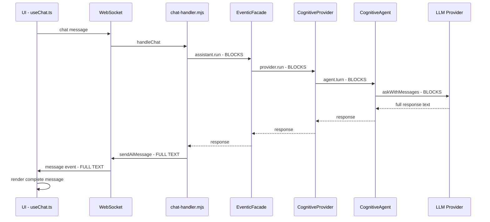
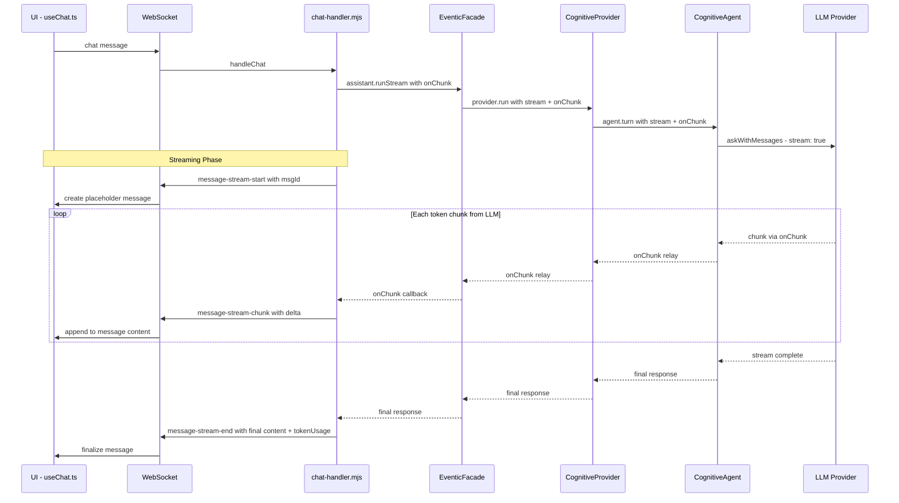

# Streaming Response Design

## Problem Statement

When a user sends a chat message, the entire AI response is collected server-side before any text reaches the UI. The user sees only a spinner and activity log entries during what can be a **10–30+ second wait** for long responses. The infrastructure for streaming exists in the LLM provider layer but is entirely unused in the main chat path.

## Current Architecture (Blocking)



### Bottleneck Points

| Layer | File | Current Behavior |
|-------|------|-----------------|
| Chat Handler | `src/server/ws-handlers/chat-handler.mjs:126-131` | Calls `assistant.run()` then sends full response via `sendAiMessage()` |
| Facade | `src/core/eventic-facade.mjs:218` | `run()` awaits provider.run() and returns complete text |
| CognitiveProvider | `src/core/agentic/cognitive-provider.mjs:186` | `run()` calls `agent.turn()` and returns complete text |
| Agent | `src/core/agentic/cognitive/agent.mjs:2039` | `_callLLM()` calls `aiProvider.askWithMessages()` non-streaming |

### Existing Streaming Infrastructure (Unused)

| Component | Location | Status |
|-----------|----------|--------|
| `callProviderStream()` | `src/core/ai-provider/index.mjs:130` | Fully implemented for all providers |
| SSE parsing in `_sendRequest()` | `src/core/eventic-ai-plugin.mjs:134-198` | Handles `stream: true` + `onChunk` |
| `EventicFacade.runStream()` | `src/core/eventic-facade.mjs:258` | Accepts `onChunk` but provider just emits one chunk |
| Provider stream adapters | `src/core/ai-provider/adapters/*.mjs` | OpenAI, Gemini, Anthropic all have stream support |
| `_pending` message pattern | `ui/src/hooks/useChat.ts` | Already supports incremental message building |

---

## Proposed Architecture (Streaming)



---

## Design Details

### 1. New WebSocket Event Types

Three new WS event types for the streaming lifecycle:

```javascript
// Sent when streaming begins — UI creates an empty AI message placeholder
{
  type: 'message-stream-start',
  payload: {
    id: 'msg-abc123',          // Unique message ID
    role: 'ai',
    timestamp: 1710000000000
  }
}

// Sent for each text chunk — UI appends delta to existing message
{
  type: 'message-stream-chunk',
  payload: {
    id: 'msg-abc123',          // Same message ID as start
    delta: 'Here is the '      // Text fragment to append
  }
}

// Sent when stream finishes — UI finalizes the message
{
  type: 'message-stream-end',
  payload: {
    id: 'msg-abc123',          // Same message ID
    content: 'Here is the full response...',  // Complete final text
    tokenUsage: { prompt: 150, completion: 300 },
    metadata: {}               // Optional extra data
  }
}
```

**Rationale**: Three-event protocol is more robust than two-event. The `start` event lets the UI show the streaming cursor before the first chunk arrives. The `end` event includes the **full content** as a reconciliation step — if any chunks were lost or arrived out of order, the final message is authoritative.

### 2. Server-Side Changes

#### 2a. Chat Handler (`src/server/ws-handlers/chat-handler.mjs`)

The primary change. Replace the blocking `run()` call with a streaming flow:

```javascript
// BEFORE (lines 126-131):
const responseText = await assistant.run(surfaceContextInput, {
  signal: activeRef.controller.signal,
  model: modelOverride,
  ws
});
const tokenUsage = assistant._lastTokenUsage || null;
sendAiMessage(ws, processContentForUI(responseText), tokenUsage ? { tokenUsage } : {});

// AFTER:
const streamMsgId = `msg-${Date.now()}-${Math.random().toString(36).slice(2, 9)}`;
let streamStarted = false;

const onChunk = (delta) => {
  if (!streamStarted) {
    wsSend(ws, 'message-stream-start', {
      id: streamMsgId,
      role: 'ai',
      timestamp: Date.now()
    });
    streamStarted = true;
  }
  wsSend(ws, 'message-stream-chunk', { id: streamMsgId, delta });
};

const responseText = await assistant.runStream(surfaceContextInput, {
  signal: activeRef.controller.signal,
  model: modelOverride,
  ws,
  onChunk
});

const tokenUsage = assistant._lastTokenUsage || null;

if (streamStarted) {
  // Streaming path — finalize with full content
  wsSend(ws, 'message-stream-end', {
    id: streamMsgId,
    content: processContentForUI(responseText),
    ...(tokenUsage ? { tokenUsage } : {})
  });
} else {
  // Fallback — no streaming occurred (short response or error)
  sendAiMessage(ws, processContentForUI(responseText), tokenUsage ? { tokenUsage } : {});
}
```

**Key design choice**: The `onChunk` callback sends raw deltas without `processContentForUI()` processing. Only the final `message-stream-end` includes the processed content. This avoids repeatedly processing partial markdown. The UI renders partial markdown in a streaming-aware component.

#### 2b. EventicFacade (`src/core/eventic-facade.mjs`)

`runStream()` already exists (line 258). The signature is compatible — it passes `stream: true` and `onChunk` to the provider. **Minimal change needed**: just ensure it returns the complete response text like `run()` does.

The only change is to make `run()` optionally accept `onChunk` and route to the streaming path internally, so `chat-handler` can use a single call:

```javascript
// In run() method — add optional onChunk support
async run(input, options = {}) {
  if (options.onChunk) {
    return this.runStream(input, options);
  }
  // ... existing non-streaming logic
}
```

#### 2c. CognitiveProvider (`src/core/agentic/cognitive-provider.mjs`)

Currently has a streaming stub that emits the whole response as one chunk. Replace with pass-through:

```javascript
// BEFORE (lines 237-240):
if (options.stream && typeof options.onChunk === 'function') {
    options.onChunk(responseText);
    streamed = true;
}

// AFTER:
// Remove this block — streaming is handled inside agent.turn()
// The onChunk callback is passed through to the agent
```

Pass `onChunk` to `agent.turn()`:

```javascript
// In run() call to agent:
const result = await this._agent.turn(messages, {
  signal: options.signal,
  onChunk: options.onChunk,  // NEW: pass through for streaming
  // ... existing options
});
```

#### 2d. CognitiveAgent (`src/core/agentic/cognitive/agent.mjs`)

This is the most complex change because the agent loop involves **multiple LLM calls** with different purposes:

| Call Type | Method | Should Stream? | Reason |
|-----------|--------|---------------|--------|
| Precheck (direct answer) | `_precheckAndRoute()` | **YES** | This IS the final response for simple queries |
| Main LLM call | `_callLLM()` in `turn()` | **Conditionally** | Only if it produces the final response (no tool calls) |
| Tool-loop LLM calls | `_callLLM()` inside tool loop | **NO** | Internal reasoning, not user-facing |
| Post-tool synthesis | `_callLLM()` after tool loop | **YES** | This IS the final response after tools complete |
| Continuation calls | `_callLLM()` in continuation loop | **YES** | Extending the response |

**Implementation strategy**: Add a `streamToUser` flag to `_callLLM()` calls. Only the calls that produce user-facing text pass `onChunk` through.

```javascript
// Modified _callLLM signature:
async _callLLM(messages, options = {}) {
  const { onChunk, ...restOptions } = options;
  
  if (onChunk) {
    // Use streaming variant
    return this._aiProvider.askWithMessagesStream(messages, {
      ...restOptions,
      stream: true,
      onChunk
    });
  }
  
  // Existing non-streaming path
  return this._aiProvider.askWithMessages(messages, restOptions);
}
```

In `turn()`, determine which calls get `onChunk`:

```javascript
// In the turn() method:
async turn(messages, options = {}) {
  const { onChunk, ...turnOptions } = options;
  
  // Precheck — if it returns a direct answer, stream it
  const precheckResult = await this._precheckAndRoute(messages, {
    ...turnOptions,
    onChunk  // Stream precheck direct answers
  });
  if (precheckResult.directAnswer) {
    return precheckResult;
  }
  
  // Main LLM call — stream initially (may produce final response)
  const result = await this._callLLM(messages, {
    ...turnOptions,
    onChunk  // Stream main call
  });
  
  if (result.toolCalls && result.toolCalls.length > 0) {
    // Tool calls detected — the streamed content so far was reasoning,
    // not the final answer. We need to handle this edge case.
    // See "Tool Call Edge Case" section below.
    
    // Execute tool calls (already handled by existing code)
    // ...
    
    // Post-tool synthesis — this IS the final answer, stream it
    const synthesisResult = await this._callLLM(synthesisMessages, {
      ...turnOptions,
      onChunk  // Stream the synthesis
    });
    return synthesisResult;
  }
  
  return result;
}
```

#### 2e. EventicAIProvider (`src/core/eventic-ai-plugin.mjs`)

Add `askWithMessagesStream()` method or modify `askWithMessages()` to accept streaming options:

```javascript
// New method or modification to existing:
async askWithMessagesStream(messages, options = {}) {
  return this._sendRequest(messages, {
    ...options,
    stream: true,
    // onChunk is already in options
  });
}
```

`_sendRequest()` already handles `stream: true` + `onChunk` (lines 134-198), so this should work with minimal changes.

### 3. UI-Side Changes

#### 3a. useChat.ts — New Event Handlers

```typescript
// Handle stream start — create a placeholder message
wsService.on('message-stream-start', (payload) => {
  const { id, role, timestamp } = payload as {
    id: string; role: string; timestamp: number;
  };
  
  setMessages(prev => [...prev, {
    id,
    role: role as 'ai',
    type: 'text',
    content: '',           // Empty — will be filled by chunks
    timestamp,
    _streaming: true       // New flag: indicates active stream
  }]);
  
  setIsThinking(false);    // Stop the spinner!
});

// Handle stream chunk — append delta to the streaming message
wsService.on('message-stream-chunk', (payload) => {
  const { id, delta } = payload as { id: string; delta: string };
  
  setMessages(prev => prev.map(msg =>
    msg.id === id
      ? { ...msg, content: msg.content + delta }
      : msg
  ));
});

// Handle stream end — finalize with authoritative content
wsService.on('message-stream-end', (payload) => {
  const { id, content, tokenUsage } = payload as {
    id: string; content: string; tokenUsage?: object;
  };
  
  setMessages(prev => prev.map(msg =>
    msg.id === id
      ? { ...msg, content, _streaming: false, tokenUsage }
      : msg
  ));
});
```

#### 3b. Message Rendering — Streaming-Aware Markdown

The message component should detect `_streaming: true` and:

1. **Show a blinking cursor** at the end of the content
2. **Render markdown incrementally** — use a markdown renderer that handles partial input gracefully (most React markdown libraries like `react-markdown` handle this fine since they re-render on prop changes)
3. **Auto-scroll** to keep the latest content visible
4. **Avoid expensive re-renders** — debounce markdown parsing if chunks arrive very fast (< 16ms apart)

```typescript
// In the message rendering component:
const MessageContent = ({ message }) => {
  const contentRef = useRef<HTMLDivElement>(null);
  
  // Auto-scroll during streaming
  useEffect(() => {
    if (message._streaming && contentRef.current) {
      contentRef.current.scrollIntoView({ behavior: 'smooth', block: 'end' });
    }
  }, [message.content, message._streaming]);
  
  return (
    <div ref={contentRef}>
      <ReactMarkdown>{message.content}</ReactMarkdown>
      {message._streaming && <span className="streaming-cursor">▊</span>}
    </div>
  );
};
```

#### 3c. ThinkingIndicator Integration

The existing `ThinkingIndicator` should transition smoothly:
- **Before streaming starts**: Show spinner + activity log (current behavior)
- **When `message-stream-start` arrives**: Hide spinner, show streaming message
- **During tool calls**: Show tool call UI (already works via `tool-call-start`/`tool-call-end`)
- **After tool calls, before synthesis stream**: Briefly show "Composing response..." then stream

### 4. Tool Call Edge Case

When the LLM responds with **both text AND tool calls**, the streamed text is the LLM's reasoning/preamble (e.g., "I'll help you with that. Let me check..."), not the final answer. This needs special handling:

**Option A — Discard streamed preamble** (Simpler):
If tool calls are detected in the response, send a `message-stream-discard` event to the UI to remove or collapse the partial message:

```javascript
// In agent turn(), after detecting tool calls:
if (result.toolCalls?.length && onChunk) {
  // Tell UI the streamed content was preamble, not the answer
  // The chat-handler wraps this
  options._onStreamDiscard?.();
}
```

**Option B — Keep preamble as commentary** (Better UX):
Convert the streamed preamble into a "thinking" or commentary message, then start a new stream for the synthesis:

```javascript
// In chat-handler, after onStreamDiscard:
wsSend(ws, 'message-stream-end', {
  id: streamMsgId,
  content: streamedSoFar,
  isCommentary: true  // UI converts this to a collapsible thinking block
});

// Start a new stream for the synthesis
streamMsgId = generateNewId();
streamStarted = false;
```

**Recommendation**: Start with **Option A** (discard) for simplicity, iterate to Option B later.

### 5. Chunk Batching and Throttling

LLM SSE streams emit tokens very frequently (every 10-50ms). Sending each token as a separate WS message creates excessive overhead. Implement server-side batching:

```javascript
// In chat-handler, wrap onChunk with a batching layer:
function createChunkBatcher(ws, msgId, intervalMs = 50) {
  let buffer = '';
  let timer = null;
  
  const flush = () => {
    if (buffer) {
      wsSend(ws, 'message-stream-chunk', { id: msgId, delta: buffer });
      buffer = '';
    }
    timer = null;
  };
  
  return {
    push(delta) {
      buffer += delta;
      if (!timer) {
        timer = setTimeout(flush, intervalMs);
      }
    },
    end() {
      if (timer) clearTimeout(timer);
      flush();
    }
  };
}
```

This batches chunks into ~50ms intervals, reducing WS messages from potentially hundreds to ~20 per second while maintaining smooth visual streaming.

### 6. Cancellation / Interruption

The existing interrupt mechanism (`type: 'interrupt'` → `AbortController.abort()`) needs to work with streaming:

- **Server side**: The AbortController signal is already passed through the chain. When `callProviderStream` is aborted, the SSE connection closes and the async generator terminates.
- **Client side**: When the user clicks "Stop", send the interrupt message as today. The stream will stop and a `message-stream-end` should be sent with whatever content was accumulated:

```javascript
// In chat-handler, handle abort during streaming:
signal.addEventListener('abort', () => {
  if (streamStarted) {
    batcher.end();
    wsSend(ws, 'message-stream-end', {
      id: streamMsgId,
      content: processContentForUI(accumulatedContent),
      interrupted: true
    });
  }
});
```

### 7. Backward Compatibility

The non-streaming `message` event must continue to work:

- **Short responses** (< ~100 tokens or completing in < 1 second): Can fall through to the non-streaming path
- **Errors**: Send via the existing `error` event type, not via streaming
- **Non-streaming providers**: If a provider doesn't support streaming, the `onChunk` callback simply never fires, and the response is sent via the existing `sendAiMessage()` path
- **The `message` event is never removed**: It remains as the fallback

---

## Implementation Plan

### Phase 1: Core Streaming Pipeline (Highest Impact)

**Goal**: Stream the final LLM response text to the UI for simple queries (no tool calls).

| Step | File | Change |
|------|------|--------|
| 1 | `src/core/eventic-ai-plugin.mjs` | Add stream option forwarding in `askWithMessages()` |
| 2 | `src/core/agentic/cognitive/agent.mjs` | Accept `onChunk` in `_callLLM()`, pass to AI provider |
| 3 | `src/core/agentic/cognitive-provider.mjs` | Pass `onChunk` from options to `agent.turn()` |
| 4 | `src/core/eventic-facade.mjs` | Make `run()` accept `onChunk` and route to streaming |
| 5 | `src/server/ws-handlers/chat-handler.mjs` | Replace blocking `run()` with streaming `onChunk` flow |
| 6 | `src/lib/ws-utils.mjs` | No changes needed — `wsSend()` works for new event types |
| 7 | `ui/src/hooks/useChat.ts` | Add handlers for `message-stream-start/chunk/end` |
| 8 | `ui/src/components/` | Add streaming cursor CSS, auto-scroll behavior |

### Phase 2: Agent Loop Streaming (Tool Calls)

**Goal**: Stream the post-tool-call synthesis response.

| Step | File | Change |
|------|------|--------|
| 1 | `src/core/agentic/cognitive/agent.mjs` | Selective `onChunk` passing in `turn()` — only for user-facing calls |
| 2 | `src/server/ws-handlers/chat-handler.mjs` | Handle stream discard for tool-call preamble |
| 3 | `ui/src/hooks/useChat.ts` | Handle `message-stream-discard` or commentary conversion |

### Phase 3: Polish

**Goal**: Optimize performance and edge cases.

| Step | File | Change |
|------|------|--------|
| 1 | `src/server/ws-handlers/chat-handler.mjs` | Add chunk batching (50ms intervals) |
| 2 | `ui/src/hooks/useChat.ts` | Debounced state updates for very fast streams |
| 3 | `ui/src/components/` | Streaming-aware markdown rendering optimization |
| 4 | `src/server/ws-handlers/chat-handler.mjs` | Graceful abort handling during streaming |
| 5 | Integration tests | Verify streaming with all provider types |

---

## Risk Assessment

| Risk | Likelihood | Mitigation |
|------|-----------|------------|
| Partial markdown rendering glitches (unclosed code blocks mid-stream) | Medium | Most markdown renderers handle this; can add a "raw text" fallback during streaming |
| Chunk loss over WS | Low | `message-stream-end` includes full content for reconciliation |
| Performance regression from frequent React re-renders | Medium | Chunk batching (50ms) + `React.memo` on message components |
| Tool-call preamble streamed to user then discarded | Medium | Phase 2 addresses this; Phase 1 can stream only non-tool responses |
| Provider doesn't support streaming | Low | Fallback to non-streaming path is automatic |

---

## Files Modified (Summary)

| File | Type of Change |
|------|---------------|
| `src/server/ws-handlers/chat-handler.mjs` | Major — streaming orchestration |
| `src/core/eventic-facade.mjs` | Minor — route `onChunk` through `run()` |
| `src/core/agentic/cognitive-provider.mjs` | Minor — pass `onChunk` to agent |
| `src/core/agentic/cognitive/agent.mjs` | Moderate — streaming in `_callLLM()` and selective routing in `turn()` |
| `src/core/eventic-ai-plugin.mjs` | Minor — expose streaming in `askWithMessages()` |
| `ui/src/hooks/useChat.ts` | Moderate — three new event handlers |
| `ui/src/services/wsService.ts` | None — already generic event emitter |
| `ui/src/components/chat/` | Minor — streaming cursor CSS, auto-scroll |
