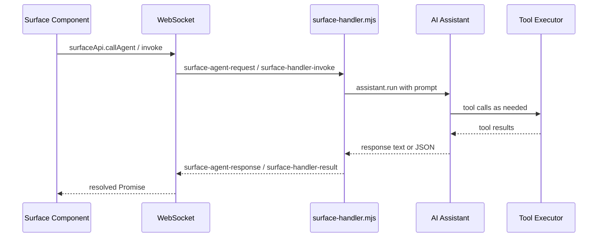
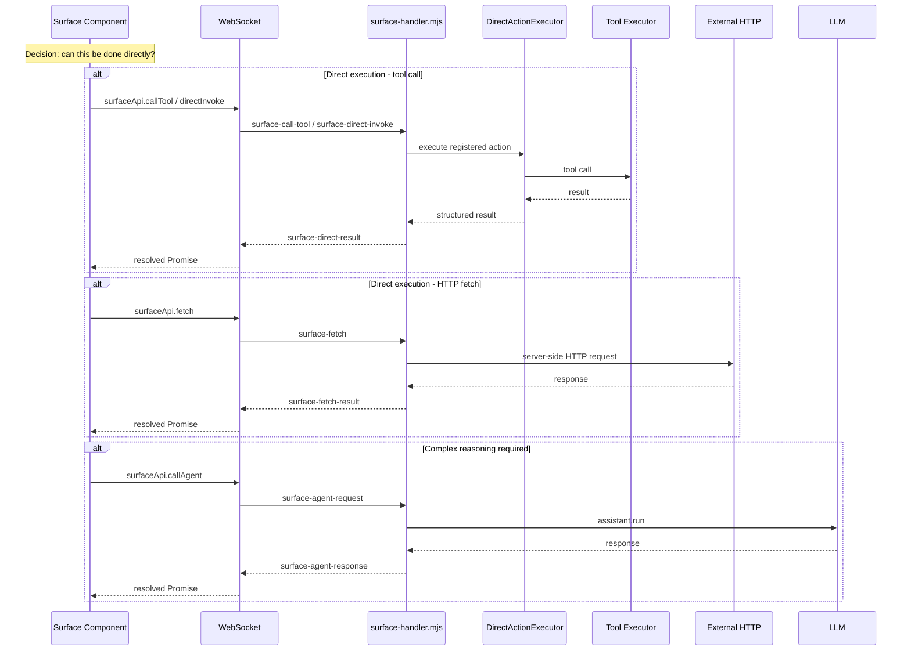
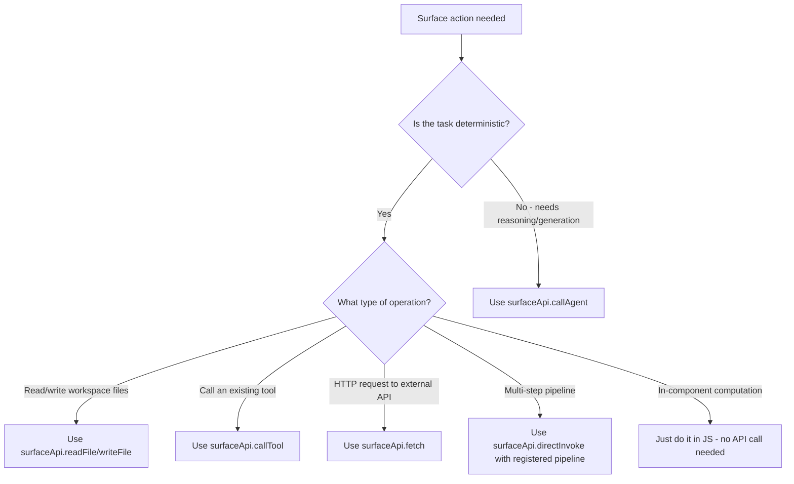

# Surface Direct Execution Enhancement Plan

## Problem Statement

Surface component action handlers currently rely on LLM calls (`surfaceApi.callAgent()` and `surfaceApi.invoke()`) for operations that could be performed directly by code — fetching data from APIs, calling tools, running computations, reading/writing files. This adds unnecessary latency, cost, and non-determinism. LLM calls should be reserved for tasks requiring reasoning, generation, or complex orchestration.

## Current Architecture



### Three Existing Interaction Patterns

| Pattern | API Call | Server Handler | Uses LLM? | Purpose |
|---------|----------|---------------|-----------|---------|
| Free-text agent | `surfaceApi.callAgent(prompt)` | `handleSurfaceAgentRequest` | **Yes** | Unstructured LLM response |
| Typed handler | `surfaceApi.invoke(name, args)` | `handleSurfaceHandlerInvoke` | **Yes** | Structured JSON via LLM |
| Direct tool | `surfaceApi.callTool(name, args)` | `handleSurfaceCallTool` | **No** | Whitelisted tool execution |

### Where LLM Calls Happen Today

1. **`ActionButtons` component** (surface-generator.mjs:328): Calls `surfaceApi.callAgent('Execute submit_scope for this project')` — this should directly call the tool
2. **`ActionButtons` component** (surface-generator.mjs:356): Calls `surfaceApi.callAgent('Show project status report')` — could read files directly
3. **`surfaceApi.invoke()` pattern** (ui-surfaces.md:198-218): The `getProjectStats` handler sends a structured prompt to the LLM to count files — this should use `callTool('list_files')` and compute in-component
4. **Auto-fix handler** (surface-handler.mjs:195-266): Correctly uses LLM since code generation requires reasoning

## Target Architecture



## Implementation Plan

### Phase 1: Backend — DirectActionExecutor + New WS Handlers

#### 1.1 Create `src/surfaces/direct-action-executor.mjs`

A server-side registry and executor for direct action handlers. Each handler is a named function that receives args and a context object (with access to toolExecutor, surfaceManager, fileTools, etc.) and returns a result.

```js
// Handler registration
executor.register('fetchRemoteObjects', {
  description: 'Fetch objects from remote API',
  inputSchema: { type: 'object', properties: { endpoint: { type: 'string' } } },
  outputSchema: { type: 'object', properties: { items: { type: 'array' } } },
  execute: async (args, ctx) => {
    const response = await fetch(args.endpoint);
    return { items: await response.json() };
  }
});

// Built-in handlers for common patterns
executor.register('readAndParseFile', { ... });
executor.register('callToolDirect', { ... });
executor.register('httpGet', { ... });
executor.register('httpPost', { ... });
```

**Key design decisions:**
- Handlers are registered at surface creation time or dynamically via WS message
- Context provides: `toolExecutor`, `surfaceManager`, `fileTools`, `workspaceRoot`
- Handlers can be surface-scoped (per-surface) or global
- Built-in handlers for common patterns: HTTP fetch, file read/parse, tool invocation

#### 1.2 Add WS handler: `surface-direct-invoke`

New handler in `src/server/ws-handlers/surface-handler.mjs`:

```js
async function handleSurfaceDirectInvoke(data, ctx) {
  const { requestId, surfaceId, actionName, args } = data.payload;
  // Look up registered direct handler
  // Execute it with context
  // Return result via 'surface-direct-result'
}
```

#### 1.3 Add WS handler: `surface-fetch`

Server-side HTTP proxy for surfaces:

```js
async function handleSurfaceFetch(data, ctx) {
  const { requestId, url, method, headers, body } = data.payload;
  // Validate URL against allowlist/blocklist
  // Perform server-side fetch
  // Return result via 'surface-fetch-result'
}
```

**Security constraints:**
- URL validation (no localhost by default, configurable allowlist)
- Request size limits
- Timeout enforcement
- Optional header injection (auth tokens from secrets manager)

#### 1.4 Add WS handler: `surface-register-action`

Allows surfaces to register their own direct action handlers dynamically from component code:

```js
async function handleSurfaceRegisterAction(data, ctx) {
  const { surfaceId, actionName, implementation } = data.payload;
  // implementation types: 'tool', 'fetch', 'pipeline'
  // Register in DirectActionExecutor
}
```

### Phase 2: Frontend — Expand surfaceApi

#### 2.1 Add `surfaceApi.directInvoke()`

```ts
directInvoke: <T>(actionName: string, args?: Record<string, unknown>, surfaceId?: string): Promise<T> => {
  // Send 'surface-direct-invoke' message
  // Listen for 'surface-direct-result'
}
```

#### 2.2 Add `surfaceApi.fetch()`

```ts
fetch: <T>(url: string, options?: { method?: string; headers?: Record<string,string>; body?: unknown }): Promise<T> => {
  // Send 'surface-fetch' message  
  // Listen for 'surface-fetch-result'
}
```

#### 2.3 Add `surfaceApi.registerAction()`

```ts
registerAction: (actionName: string, implementation: ActionImplementation): void => {
  // Send 'surface-register-action' to server
  // Implementation spec: { type: 'tool', toolName, args } | { type: 'fetch', url, method } | { type: 'pipeline', steps: [...] }
}
```

### Phase 3: Update Surface Generator Templates

#### 3.1 Update `ActionButtons` component

**Before (LLM call):**
```jsx
await surfaceApi.callAgent(`Execute ${currentAction.tool} for this project`);
```

**After (direct tool call):**
```jsx
await surfaceApi.callTool(currentAction.tool, { project_id: projectId });
```

#### 3.2 Update documentation examples

Replace `callAgent` examples with `callTool` / `directInvoke` / `fetch` equivalents where the operation is deterministic.

### Phase 4: Documentation Updates

#### 4.1 Update `docs/guides/ui-surfaces.md`

- Add section: "Direct Execution vs LLM Calls"
- Add decision flowchart for when to use each API
- Update Action Buttons example to use direct invocation
- Add `surfaceApi.fetch()` documentation
- Add `surfaceApi.directInvoke()` documentation
- Add `surfaceApi.registerAction()` documentation

#### 4.2 Update `docs/guides/surface-components.md`

- Add `surfaceApi.fetch()` to the Global APIs section
- Add `surfaceApi.directInvoke()` to the Global APIs section
- Add `surfaceApi.registerAction()` to the Global APIs section

### Phase 5: Update System Prompt

Update `src/core/system-prompt.mjs` to instruct the LLM that when generating surface components, it should prefer direct execution patterns over `callAgent`/`invoke` for:
- Data fetching (use `fetch` or `callTool`)
- File operations (use `readFile`, `writeFile`, `callTool`)
- Tool invocations (use `callTool`)
- HTTP requests (use `fetch`)

Reserve `callAgent` only for operations requiring LLM reasoning.

## Decision Flowchart: Which API to Use?



## Files to Modify

| File | Change |
|------|--------|
| `src/surfaces/direct-action-executor.mjs` | **NEW** — DirectActionExecutor class |
| `src/server/ws-handlers/surface-handler.mjs` | Add `surface-direct-invoke`, `surface-fetch`, `surface-register-action` handlers |
| `ui/src/components/features/surface/surfaceApi.ts` | Add `directInvoke()`, `fetch()`, `registerAction()` |
| `src/project-management/surface-generator.mjs` | Update `ActionButtons` template to use direct calls |
| `docs/guides/ui-surfaces.md` | Add direct execution section, update examples |
| `docs/guides/surface-components.md` | Add new API methods to reference |
| `src/core/system-prompt.mjs` | Add guidance for preferring direct execution in surfaces |

## Security Considerations

1. **HTTP fetch proxy**: URL allowlist/blocklist to prevent SSRF attacks
2. **Direct action execution**: Sandboxed context, no access to process/filesystem beyond workspace
3. **Tool allowlist**: Already enforced in `handleSurfaceCallTool` — extend as needed
4. **Rate limiting**: Consider adding per-surface rate limits for fetch/directInvoke
