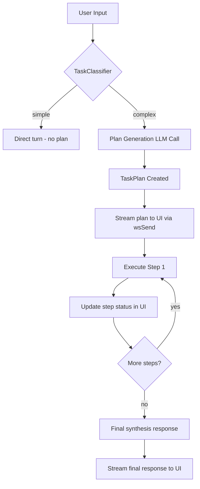
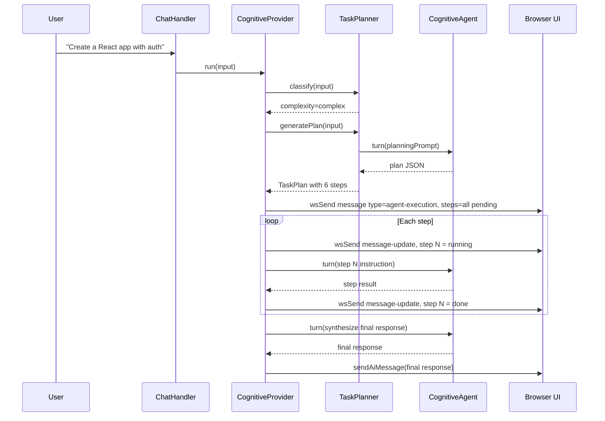

# Task Decomposition & Plan Execution Design

## Problem Statement

When a user asks the cognitive agent to perform a complex, multi-step task (e.g. "create a React app with authentication"), the agent currently dives straight into tool calls without showing the user what it plans to do. The user has no visibility into the work plan and cannot see progress.

**Goal:** Add a structured task decomposition layer that:
1. Classifies incoming requests as **simple** (chat/single-step) vs **complex** (multi-step)
2. For complex requests, generates a visible **task plan** before execution
3. Streams the plan and step-by-step progress to the UI as a live-updating message
4. Executes each step sequentially, updating status in real-time
5. Degrades gracefully — simple chat and single-tool requests bypass planning entirely

## Architecture Overview



## Key Design Decisions

### 1. Classification: Simple vs Complex

The classifier runs **before** the main `turn()` call. It uses a fast LLM call with a constrained JSON schema to determine complexity.

**Classification heuristics** (checked in order, short-circuit on match):

| Signal | Classification | Example |
|--------|---------------|---------|
| Input < 20 words, no action verbs | **simple** | "What is a closure?" |
| Greeting / small talk pattern | **simple** | "Hello", "Thanks!" |
| Single file operation pattern | **simple** | "Read package.json" |
| Contains "create", "build", "implement", "refactor" + noun | **complex** | "Create a REST API" |
| Contains multiple distinct requests | **complex** | "Read the config, update the port, and restart" |
| Mentions multiple files/components | **complex** | "Update the auth module and its tests" |

**Fallback:** If heuristics are inconclusive, a fast LLM call (~100 tokens) classifies:

```json
{ "complexity": "simple" | "complex", "reason": "..." }
```

### 2. Plan Generation

For complex tasks, a **planning LLM call** generates a structured plan:

```json
{
  "title": "Create React App with Authentication",
  "steps": [
    { "id": "step-1", "label": "Scaffold React project with Vite", "tools": ["execute_command"] },
    { "id": "step-2", "label": "Install auth dependencies", "tools": ["execute_command"] },
    { "id": "step-3", "label": "Create auth context and provider", "tools": ["write_file"] },
    { "id": "step-4", "label": "Create login/signup components", "tools": ["write_file"] },
    { "id": "step-5", "label": "Add route protection", "tools": ["write_file", "edit_file"] },
    { "id": "step-6", "label": "Verify build succeeds", "tools": ["execute_command"] }
  ]
}
```

The plan generation uses a dedicated system prompt that instructs the LLM to decompose the task into 3-10 actionable steps, each achievable in a single tool-call round.

### 3. Task State Model

```typescript
interface TaskPlan {
  id: string;              // unique plan ID
  title: string;           // human-readable plan title
  steps: TaskStep[];       // ordered steps
  status: 'planning' | 'executing' | 'completed' | 'failed' | 'cancelled';
  createdAt: number;
  completedAt?: number;
}

interface TaskStep {
  id: string;              // e.g. "step-1"
  label: string;           // human-readable description
  status: 'pending' | 'running' | 'done' | 'failed' | 'skipped';
  tools?: string[];        // expected tools (informational)
  result?: string;         // brief result summary
  error?: string;          // error message if failed
  startedAt?: number;
  completedAt?: number;
}
```

### 4. UI Rendering

We reuse the existing `agent-execution` message type which already supports `steps: Step[]` with `{ label, status: 'done' | 'pending' | 'failed' }`. The UI already has `StepIndicator` rendering.

**Message flow to the UI:**

1. **Plan created:** Send an `agent-execution` message with all steps in `pending` status
2. **Step starts:** Update the message (same ID) with the current step set to `running` (we map to `pending` with a `running` visual indicator)
3. **Step completes:** Update with step set to `done`
4. **Step fails:** Update with step set to `failed`
5. **All done:** Send a final `text` message with the synthesis response

Since the UI already handles `_pending` messages and live updates via WebSocket, we use **message update** semantics: send the same message ID with updated step statuses.

**New WebSocket message type:** `message-update` — patches an existing message by ID:

```json
{
  "type": "message-update",
  "payload": {
    "id": "plan-123",
    "steps": [
      { "label": "Scaffold React project", "status": "done" },
      { "label": "Install dependencies", "status": "pending" },
      ...
    ]
  }
}
```

### 5. Integration Points

#### A. `CognitiveAgent.turn()` modification

The `turn()` method gets a new **planning phase** between Steps 1-4 (cognitive processing) and Step 7 (LLM call):

```
Steps 1-4: PERCEIVE, ENCODE, ORIENT, ATTEND
Step 5: GUARD (safety check)
>> NEW: Step 5.5: CLASSIFY & PLAN (if complex, generate plan)
Step 6: RECALL
Step 7: THINK (for complex: execute plan steps sequentially)
Steps 8-11: EXECUTE, VALIDATE, REMEMBER, EVOLVE
```

#### B. New file: `src/core/agentic/cognitive/task-planner.mjs`

Contains:
- `TaskClassifier` — determines simple vs complex
- `TaskPlanner` — generates structured plans from complex requests
- `PlanExecutor` — executes plan steps sequentially, calling `turn()` for each step
- `TaskPlan` / `TaskStep` — data model classes

#### C. `CognitiveProvider.run()` modification

The provider's `run()` method needs to:
1. Accept a `ws` reference (already available in deps) to stream plan updates
2. Call the planner before delegating to `agent.turn()`
3. For complex tasks, loop over plan steps calling `turn()` for each

#### D. `chat-handler.mjs` modification

The chat handler needs to handle `message-update` messages — when the agent sends step updates, they get forwarded to the client as patches to existing messages.

### 6. Execution Flow (Complex Task)



### 7. System Prompt Addition

Add to the cognitive agent system prompt:

```
**Task Planning:**
For complex, multi-step tasks (creating projects, refactoring codebases, implementing features),
you will automatically decompose the work into a structured plan before executing. Each step in the
plan is executed sequentially. You can see the plan and your progress.
If a step fails, you may retry it or skip it based on whether subsequent steps depend on it.
```

### 8. Error Handling & Resilience

- **Step failure:** Mark step as `failed`, continue to next step if independent; halt if dependent
- **Cancellation:** If user sends `interrupt`, mark remaining steps as `skipped`
- **LLM errors:** Retry retryable errors; on permanent failure, mark step failed and try to continue
- **Plan generation failure:** Fall back to direct `turn()` (no plan, same as current behavior)
- **Classification failure:** Default to `simple` (conservative — no plan overhead)

### 9. Files to Create/Modify

| File | Action | Purpose |
|------|--------|---------|
| `src/core/agentic/cognitive/task-planner.mjs` | **CREATE** | TaskClassifier + TaskPlanner + PlanExecutor |
| `src/core/agentic/cognitive/agent.mjs` | MODIFY | Add plan-aware turn method |
| `src/core/agentic/cognitive-provider.mjs` | MODIFY | Integrate planner into run() |
| `src/core/agentic/cognitive/config.mjs` | MODIFY | Add planner config defaults |
| `src/server/ws-handlers/chat-handler.mjs` | MODIFY | Support message-update flow |
| `src/lib/ws-utils.mjs` | MODIFY | Add `wsSendUpdate()` helper |
| `ui/src/types/index.ts` | MODIFY | Extend Step type with `running` status |
| `ui/src/components/chat/MessageItem.tsx` | MODIFY | Handle message updates for steps |
| `ui/src/services/wsService.ts` | MODIFY | Handle `message-update` WS events |
| `src/core/agentic/cognitive/__tests__/task-planner.test.mjs` | **CREATE** | Tests for classifier + planner |

### 10. Configuration

Add to `config.mjs` defaults:

```javascript
planner: {
    enabled: true,                    // feature flag
    classificationModel: null,        // null = use same model
    planningModel: null,              // null = use same model
    maxSteps: 10,                     // max steps in a plan
    minComplexityWords: 20,           // min words for heuristic check
    autoRetryFailedSteps: false,      // auto-retry failed steps
    skipDependentOnFailure: true,     // skip steps that depend on failed ones
}
```
