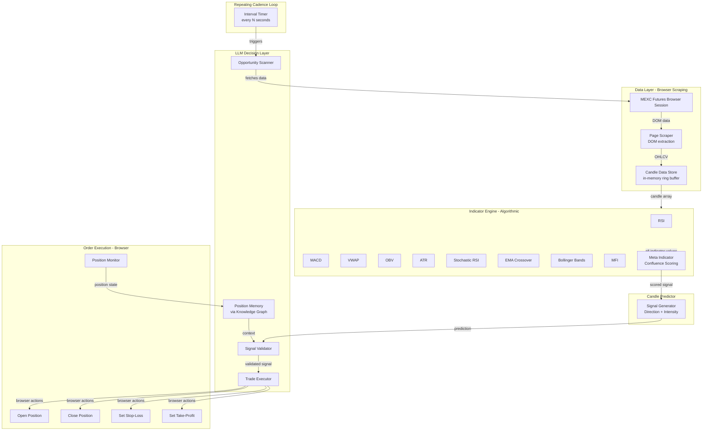
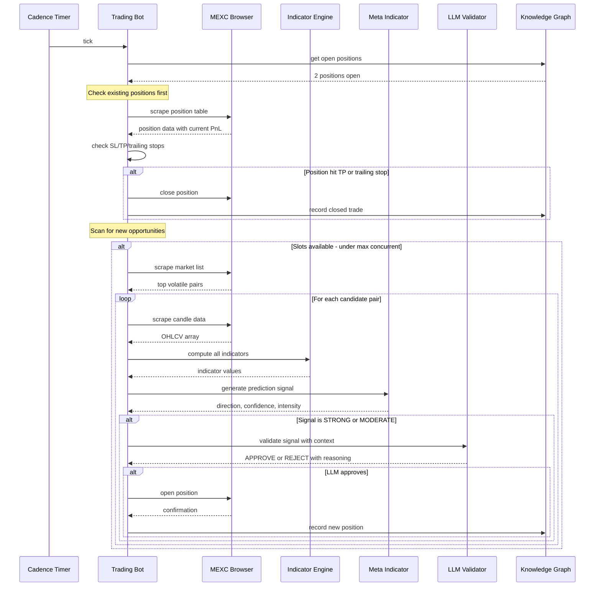

# Trading Bot Architecture — LLM-Driven Crypto Scalper

## Overview

An LLM-driven crypto scalping system built as an extension of the existing `trading-chart` plugin. The system uses browser automation to interact with MEXC Futures, an algorithmic scoring engine for signal generation, and the LLM as the decision-maker that validates signals and orchestrates trade execution.

### Core Strategy
- **Many small, high-leverage bets** on volatile crypto assets
- **Predict next 1-2 candles** using a meta-indicator (confluence of technical indicators)
- **Take profits quickly, cut losses rapidly** — +3% TP, -5% SL
- **LLM runs on a repeating cadence** (e.g., every 1 minute for 1m charts)

### Risk Parameters (Configurable via Plugin Settings)
| Parameter | Default |
|---|---|
| Max position size | $50 |
| Max leverage | 20x |
| Max concurrent positions | 3 |
| Stop-loss | -5% |
| Take-profit | +3% |
| Trading timeframe | 1m |
| Max daily loss | $150 (3x position size) |

---

## System Architecture



---

## Tool Design — New Tools to Add to Trading Chart Plugin

All tools will be registered in the `trading-chart` plugin via `api.tools.register()`. The plugin will be organized into modules:

### Module Structure

```
plugins/trading-chart/
  index.mjs                    # Plugin entry — registers all tools
  plugin.json                  # Plugin manifest
  lib/
    indicators.mjs             # Full indicator library (server-side)
    meta-indicator.mjs         # Confluence scoring / signal generator
    candle-store.mjs           # In-memory ring buffer for candle data
    risk-manager.mjs           # Position sizing, SL/TP, max loss checks
    mexc-browser.mjs           # MEXC-specific browser automation helpers
    scanner.mjs                # Market scanner for opportunity detection
```

---

### Tool 1: `trading_scan_markets`

**Purpose**: Scan available MEXC futures pairs for volatility and trading opportunities.

```javascript
{
  name: 'trading_scan_markets',
  description: 'Scan MEXC futures markets for high-volatility trading opportunities. Returns ranked list of pairs by volatility, volume, and trend strength.',
  parameters: {
    type: 'object',
    properties: {
      min_volume_24h: {
        type: 'number',
        description: 'Minimum 24h volume in USDT. Default: 1000000'
      },
      min_volatility: {
        type: 'number',
        description: 'Minimum price change % in last hour. Default: 1.0'
      },
      max_results: {
        type: 'number',
        description: 'Max pairs to return. Default: 10'
      },
      category: {
        type: 'string',
        enum: ['all', 'hot', 'new', 'gainers', 'losers'],
        description: 'Filter category. Default: hot'
      }
    }
  },
  // Returns: Array of { symbol, price, change_1h, change_24h, volume_24h, volatility_score }
}
```

**Implementation**: Uses the browser plugin to navigate to MEXC futures market list, scrapes the DOM for pair data, ranks by volatility metrics.

---

### Tool 2: `trading_get_candles`

**Purpose**: Fetch OHLCV candle data for a specific pair from MEXC.

```javascript
{
  name: 'trading_get_candles',
  description: 'Fetch OHLCV candle data for a crypto futures pair from MEXC. Returns recent candles for analysis.',
  parameters: {
    type: 'object',
    properties: {
      symbol: {
        type: 'string',
        description: 'Trading pair symbol, e.g. BTCUSDT, ETHUSDT'
      },
      timeframe: {
        type: 'string',
        enum: ['1m', '5m', '15m', '30m', '1h', '4h', '1d'],
        description: 'Candle timeframe. Default: 1m'
      },
      count: {
        type: 'number',
        description: 'Number of candles to fetch. Default: 100, Max: 500'
      }
    },
    required: ['symbol']
  },
  // Returns: { symbol, timeframe, candles: [{time, open, high, low, close, volume}] }
}
```

**Implementation**: Navigates to MEXC chart for the symbol, scrapes or intercepts WebSocket data from TradingView widget embedded in MEXC, or falls back to DOM scraping of the order book and recent trades to reconstruct candle data.

---

### Tool 3: `trading_compute_indicators`

**Purpose**: Compute a full suite of technical indicators on candle data.

```javascript
{
  name: 'trading_compute_indicators',
  description: 'Compute technical indicators on candle data. Returns all indicator values for the most recent candles.',
  parameters: {
    type: 'object',
    properties: {
      symbol: {
        type: 'string',
        description: 'Symbol to compute indicators for. Must have candle data loaded via trading_get_candles first.'
      },
      indicators: {
        type: 'array',
        description: 'Which indicators to compute. Default: all',
        items: {
          type: 'string',
          enum: ['rsi', 'macd', 'ema', 'sma', 'bollinger', 'atr', 'obv', 'vwap', 'stoch_rsi', 'mfi', 'adx', 'cci', 'williams_r', 'ichimoku', 'pivot_points']
        }
      },
      lookback: {
        type: 'number',
        description: 'Number of recent candles to return indicator values for. Default: 20'
      }
    },
    required: ['symbol']
  },
  // Returns: { symbol, timeframe, candle_count, indicators: { rsi: [...], macd: { line: [...], signal: [...], histogram: [...] }, ... } }
}
```

**Indicator Library** (server-side computations in `lib/indicators.mjs`):

| Indicator | Params | Output | Purpose |
|---|---|---|---|
| RSI | period=14 | 0-100 | Overbought/oversold |
| MACD | fast=12, slow=26, signal=9 | line, signal, histogram | Trend momentum |
| EMA | periods=[9,21,50,200] | price levels | Dynamic S/R |
| SMA | periods=[20,50,200] | price levels | Trend direction |
| Bollinger Bands | period=20, stdDev=2 | upper, middle, lower, bandwidth, %B | Volatility |
| ATR | period=14 | value | Volatility magnitude |
| OBV | — | cumulative | Volume-price confirmation |
| VWAP | — | price | Fair value |
| Stochastic RSI | period=14, k=3, d=3 | %K, %D | Momentum |
| MFI | period=14 | 0-100 | Money flow |
| ADX | period=14 | 0-100, +DI, -DI | Trend strength |
| CCI | period=20 | value | Cyclical momentum |
| Williams %R | period=14 | -100 to 0 | Overbought/oversold |
| Ichimoku | 9,26,52 | tenkan, kijun, senkou_a, senkou_b, chikou | Cloud support |
| Pivot Points | — | pivot, R1-R3, S1-S3 | Key levels |

---

### Tool 4: `trading_predict_candles`

**Purpose**: The meta-indicator — produces a directional signal with confidence for the next 1-2 candles.

```javascript
{
  name: 'trading_predict_candles',
  description: 'Generate a prediction for the next 1-2 candles using the confluence scoring engine. Combines all indicators into a single directional signal with confidence level.',
  parameters: {
    type: 'object',
    properties: {
      symbol: {
        type: 'string',
        description: 'Symbol to predict. Must have candle + indicator data loaded.'
      },
      horizon: {
        type: 'number',
        enum: [1, 2],
        description: 'Predict next N candles. Default: 1'
      }
    },
    required: ['symbol']
  },
  // Returns: {
  //   symbol, timeframe, timestamp,
  //   prediction: {
  //     direction: 'LONG' | 'SHORT' | 'NEUTRAL',
  //     confidence: 0.0-1.0,
  //     intensity: 'WEAK' | 'MODERATE' | 'STRONG',
  //     expected_move_pct: number,
  //     entry_price: number,
  //     stop_loss: number,
  //     take_profit: number,
  //   },
  //   signal_components: {
  //     trend_score: number,       // EMA alignment, ADX, Ichimoku
  //     momentum_score: number,    // RSI, MACD, Stoch RSI
  //     volatility_score: number,  // BB squeeze/expansion, ATR
  //     volume_score: number,      // OBV, MFI, volume trend
  //     support_resistance: number // proximity to key levels
  //   },
  //   confluence_score: number,  // -100 to +100 (negative=short, positive=long)
  //   risk_reward_ratio: number
  // }
}
```

**Scoring Algorithm** (in `lib/meta-indicator.mjs`):

The confluence score is computed as a weighted sum of sub-scores:

```
confluence = 0.30 * trend_score
           + 0.25 * momentum_score
           + 0.20 * volatility_score
           + 0.15 * volume_score
           + 0.10 * support_resistance_score
```

Each sub-score ranges from -100 to +100:
- **Trend**: EMA alignment (9>21>50 = bullish), ADX strength, Ichimoku cloud position
- **Momentum**: RSI position + divergences, MACD histogram direction, Stochastic RSI crossovers
- **Volatility**: Bollinger Band %B position, BB squeeze detection, ATR expansion/contraction
- **Volume**: OBV trend vs price trend, MFI divergence, volume spike detection
- **S/R**: Distance to pivot points, proximity to recent swing highs/lows

Confidence = `abs(confluence) / 100`, clamped to [0, 1].
Direction = `confluence > 15 ? LONG : confluence < -15 ? SHORT : NEUTRAL`.
Intensity = based on confidence thresholds: <0.4 WEAK, 0.4-0.7 MODERATE, >0.7 STRONG.

---

### Tool 5: `trading_open_position`

**Purpose**: Open a leveraged futures position on MEXC via browser.

```javascript
{
  name: 'trading_open_position',
  description: 'Open a leveraged futures position on MEXC via browser automation. Includes setting stop-loss and take-profit.',
  parameters: {
    type: 'object',
    properties: {
      symbol: {
        type: 'string',
        description: 'Trading pair, e.g. BTCUSDT'
      },
      direction: {
        type: 'string',
        enum: ['LONG', 'SHORT'],
        description: 'Position direction'
      },
      size_usdt: {
        type: 'number',
        description: 'Position size in USDT. Max enforced by risk manager.'
      },
      leverage: {
        type: 'number',
        description: 'Leverage multiplier. Max enforced by risk manager.'
      },
      stop_loss_pct: {
        type: 'number',
        description: 'Stop-loss as % from entry. Default from settings.'
      },
      take_profit_pct: {
        type: 'number',
        description: 'Take-profit as % from entry. Default from settings.'
      },
      order_type: {
        type: 'string',
        enum: ['market', 'limit'],
        description: 'Order type. Default: market'
      },
      limit_price: {
        type: 'number',
        description: 'Limit price if order_type is limit'
      }
    },
    required: ['symbol', 'direction', 'size_usdt']
  },
  // Returns: { success, position_id, symbol, direction, entry_price, size, leverage, sl_price, tp_price, timestamp }
}
```

**Implementation**: Browser automation sequence on MEXC Futures:
1. Navigate to `/futures/{symbol}`
2. Set leverage via the leverage selector
3. Select Long/Short tab
4. Enter position size
5. Set order type (market/limit)
6. Set TP/SL in the order panel
7. Click submit
8. Confirm in popup
9. Verify position appears in open positions table
10. Record in memory (knowledge graph)

---

### Tool 6: `trading_close_position`

**Purpose**: Close an open position on MEXC.

```javascript
{
  name: 'trading_close_position',
  description: 'Close an open futures position on MEXC via browser.',
  parameters: {
    type: 'object',
    properties: {
      symbol: {
        type: 'string',
        description: 'Symbol of the position to close'
      },
      close_pct: {
        type: 'number',
        description: 'Percentage of position to close. Default: 100 (full close)'
      }
    },
    required: ['symbol']
  },
  // Returns: { success, symbol, close_price, pnl_usdt, pnl_pct, timestamp }
}
```

---

### Tool 7: `trading_get_positions`

**Purpose**: Get current open positions from MEXC.

```javascript
{
  name: 'trading_get_positions',
  description: 'Get all currently open futures positions from MEXC browser.',
  parameters: {
    type: 'object',
    properties: {}
  },
  // Returns: { positions: [{ symbol, direction, entry_price, mark_price, size, leverage, unrealized_pnl, unrealized_pnl_pct, liquidation_price, margin }] }
}
```

---

### Tool 8: `trading_get_account`

**Purpose**: Get account balance and margin info.

```javascript
{
  name: 'trading_get_account',
  description: 'Get MEXC futures account balance, available margin, and unrealized PnL.',
  parameters: {
    type: 'object',
    properties: {}
  },
  // Returns: { balance_usdt, available_margin, used_margin, unrealized_pnl, margin_ratio }
}
```

---

### Tool 9: `trading_modify_position`

**Purpose**: Modify stop-loss or take-profit on an existing position.

```javascript
{
  name: 'trading_modify_position',
  description: 'Modify stop-loss or take-profit levels on an open position via MEXC browser.',
  parameters: {
    type: 'object',
    properties: {
      symbol: {
        type: 'string',
        description: 'Symbol of the position to modify'
      },
      new_stop_loss: {
        type: 'number',
        description: 'New stop-loss price'
      },
      new_take_profit: {
        type: 'number',
        description: 'New take-profit price'
      }
    },
    required: ['symbol']
  }
}
```

---

### Tool 10: `trading_start_bot`

**Purpose**: Start the automated trading loop on a cadence.

```javascript
{
  name: 'trading_start_bot',
  description: 'Start the automated trading bot. Runs on a repeating cadence, scanning for opportunities and executing trades.',
  parameters: {
    type: 'object',
    properties: {
      cadence_seconds: {
        type: 'number',
        description: 'How often to run the trading cycle in seconds. Default: 60 (1 minute)'
      },
      symbols: {
        type: 'array',
        items: { type: 'string' },
        description: 'Specific symbols to trade. If empty, uses scanner to find opportunities.'
      },
      mode: {
        type: 'string',
        enum: ['live', 'paper'],
        description: 'Trading mode. Paper mode logs trades but does not execute. Default: paper'
      },
      strategy: {
        type: 'string',
        enum: ['scalp', 'momentum', 'reversal'],
        description: 'Trading strategy. Default: scalp'
      }
    }
  },
  // Returns: { bot_id, status: 'running', cadence, mode, symbols, started_at }
}
```

**Implementation**: Sets up a `setInterval` that on each tick:
1. Calls `trading_scan_markets` or iterates provided symbols
2. For each symbol: `trading_get_candles` → `trading_compute_indicators` → `trading_predict_candles`
3. Sends prediction + context to LLM via `api.ai.ask()` for validation
4. If LLM approves: `trading_open_position`
5. Checks open positions for SL/TP hits or trailing stop adjustments
6. Updates memory with trade log

---

### Tool 11: `trading_stop_bot`

**Purpose**: Stop the automated trading loop.

```javascript
{
  name: 'trading_stop_bot',
  description: 'Stop the automated trading bot. Does not close open positions.',
  parameters: {
    type: 'object',
    properties: {
      close_all: {
        type: 'boolean',
        description: 'Also close all open positions. Default: false'
      }
    }
  }
}
```

---

### Tool 12: `trading_get_trade_history`

**Purpose**: Retrieve trade history from memory.

```javascript
{
  name: 'trading_get_trade_history',
  description: 'Get trading history including PnL, win rate, and performance metrics.',
  parameters: {
    type: 'object',
    properties: {
      period: {
        type: 'string',
        enum: ['today', 'week', 'month', 'all'],
        description: 'Time period for history. Default: today'
      },
      symbol: {
        type: 'string',
        description: 'Filter by symbol. Optional.'
      }
    }
  },
  // Returns: { trades: [...], summary: { total_trades, wins, losses, win_rate, total_pnl, avg_pnl, best_trade, worst_trade, sharpe_ratio } }
}
```

---

### Tool 13: `trading_visualize`

**Purpose**: Generate a trading chart with current indicators and signals overlaid (extends existing `generate_trading_chart`).

```javascript
{
  name: 'trading_visualize',
  description: 'Generate an interactive chart for a symbol with live data, indicators, and prediction signals overlaid.',
  parameters: {
    type: 'object',
    properties: {
      symbol: {
        type: 'string',
        description: 'Symbol to chart'
      },
      show_prediction: {
        type: 'boolean',
        description: 'Overlay next-candle prediction arrow. Default: true'
      },
      show_positions: {
        type: 'boolean',
        description: 'Show entry/exit points for open positions. Default: true'
      },
      indicators: {
        type: 'array',
        items: { type: 'string' },
        description: 'Which indicators to overlay. Default: ema, bollinger'
      }
    },
    required: ['symbol']
  }
}
```

---

## Data Flow — Single Trading Cycle



---

## Plugin Settings Schema

```javascript
const DEFAULT_SETTINGS = {
  // Existing chart settings
  enabled: true,
  defaultWidth: 800,
  defaultHeight: 450,
  defaultAnimationSpeed: 100,
  defaultTheme: 'dark',
  
  // Trading bot settings
  trading_enabled: false,
  max_position_size_usdt: 50,
  max_leverage: 20,
  max_concurrent_positions: 3,
  default_stop_loss_pct: 5,
  default_take_profit_pct: 3,
  default_cadence_seconds: 60,
  default_timeframe: '1m',
  max_daily_loss_usdt: 150,
  trading_mode: 'paper',  // 'paper' | 'live'
  
  // Predictor settings
  min_confidence_threshold: 0.5,
  min_signal_intensity: 'MODERATE',  // 'WEAK' | 'MODERATE' | 'STRONG'
  confluence_threshold: 25,  // minimum absolute confluence score to consider
  
  // Indicator weights for meta-indicator
  weight_trend: 0.30,
  weight_momentum: 0.25,
  weight_volatility: 0.20,
  weight_volume: 0.15,
  weight_support_resistance: 0.10,
};
```

---

## Memory Schema (Knowledge Graph Entities)

The bot uses the existing knowledge-graph plugin for persistence:

### Entity: `TradingPosition`
```
- symbol: BTCUSDT
- direction: LONG
- entry_price: 65432.50
- size_usdt: 50
- leverage: 20
- stop_loss: 62160.87
- take_profit: 67395.47
- status: open | closed
- opened_at: ISO timestamp
- closed_at: ISO timestamp (if closed)
- close_price: (if closed)
- pnl_usdt: (if closed)
- pnl_pct: (if closed)
- signal_confidence: 0.73
- confluence_score: 45
```

### Entity: `TradingSession`
```
- session_id: bot-{timestamp}
- started_at: ISO timestamp
- mode: paper | live
- cadence: 60
- symbols_traded: [BTCUSDT, ETHUSDT]
- total_trades: 15
- wins: 9
- losses: 6
- total_pnl: +12.50
- status: running | stopped
```

### Entity: `TradingConfig`
```
- active_settings snapshot
- updated_at: ISO timestamp
```

---

## Implementation Order

### Phase 1: Core Infrastructure
1. Create `lib/` directory structure under `plugins/trading-chart/`
2. Build `candle-store.mjs` — in-memory ring buffer for OHLCV data
3. Build `indicators.mjs` — full server-side indicator library (RSI, MACD, ATR, OBV, VWAP, Stochastic RSI, MFI, ADX, CCI, Williams %R, Ichimoku, Pivot Points)
4. Build `meta-indicator.mjs` — confluence scoring engine
5. Build `risk-manager.mjs` — position sizing, SL/TP calculations, daily loss tracking

### Phase 2: Data Tools
6. Implement `trading_get_candles` tool + MEXC browser scraping
7. Implement `trading_compute_indicators` tool
8. Implement `trading_predict_candles` tool
9. Implement `trading_scan_markets` tool

### Phase 3: Execution Tools
10. Build `mexc-browser.mjs` — MEXC-specific browser automation helpers
11. Implement `trading_get_account` tool
12. Implement `trading_get_positions` tool
13. Implement `trading_open_position` tool
14. Implement `trading_close_position` tool
15. Implement `trading_modify_position` tool

### Phase 4: Bot Loop & Visualization
16. Implement `trading_start_bot` / `trading_stop_bot` tools
17. Implement `trading_get_trade_history` tool
18. Implement `trading_visualize` tool (extends existing chart)
19. Update `plugin.json` and settings schema

### Phase 5: Frontend Enhancements
20. Extend indicator types in `ui/src/components/chat/tradingchart/types.ts`
21. Add new indicators to `ui/src/components/chat/tradingchart/indicators.ts`
22. Add prediction overlay rendering to `TradingChartEngine.ts`
23. Add trading position markers to chart

---

## Key Design Decisions

1. **Browser-only execution**: All MEXC interaction through Puppeteer browser automation. This means the bot's speed is limited by page load/DOM interaction times (~2-5s per action). Acceptable for 1m+ timeframes.

2. **Server-side indicators**: Indicators computed in Node.js (not in the browser chart renderer). The existing frontend `indicators.ts` handles display; the new `lib/indicators.mjs` handles analysis. This separation keeps the predictor fast and independent of the UI.

3. **LLM as validator, not predictor**: The algorithmic scoring engine does the heavy lifting of signal generation. The LLM validates signals using broader context (recent trade history, market conditions, position sizing). This is cheaper and more consistent than using the LLM as a primary predictor.

4. **Paper trading default**: The system starts in paper mode. Live mode requires explicit activation. All paper trades are logged identically to live trades for backtesting.

5. **Knowledge graph for state**: Trade history and position tracking use the existing knowledge-graph plugin. This provides persistence across restarts and allows the LLM to query trade history contextually.

6. **Risk manager as hard limit**: The risk manager enforces position size, leverage, concurrent position, and daily loss limits regardless of what the LLM requests. These are safety rails that cannot be overridden by the LLM.
