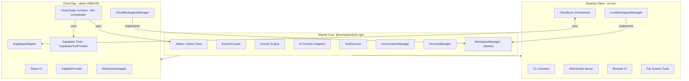
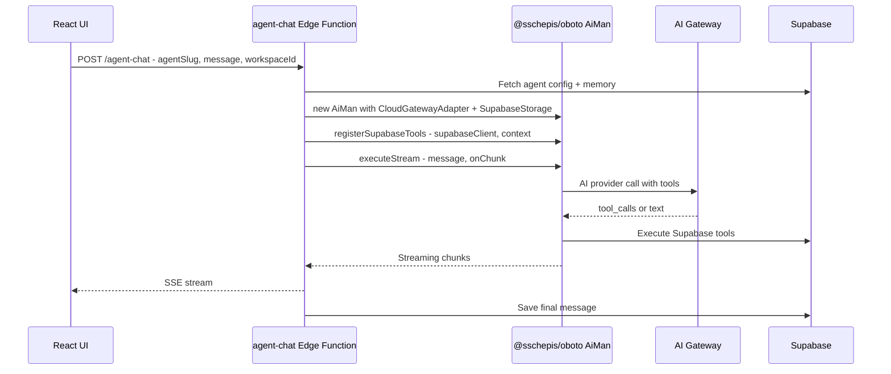
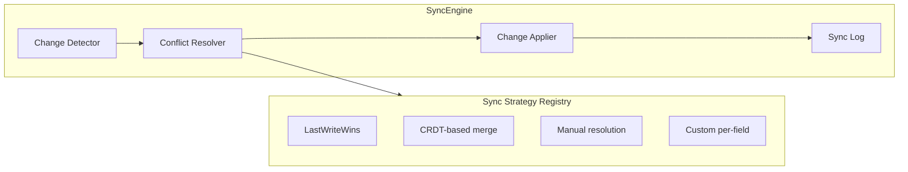

# Oboto Unification Plan

## 1. Problem Statement

The Oboto system is split across two codebases that have diverged in ways that create confusion, technical debt, and duplicated effort:

| Concern | Client (ai-man / @sschepis/oboto) | Cloud (oboto-1fdb6109) |
|---|---|---|
| **Agent Loop** | Sophisticated EventicFacade → AgenticProviderRegistry → CognitiveProvider (~70K chars agent.mjs) | Standalone 1149-line Deno edge function with own loop, retry, timeout |
| **Tool Registry** | ToolExecutor with handler system, 50+ tools | Inline TOOL_REGISTRY with 10 Supabase-specific tools |
| **AI Provider** | Multi-provider adapter system (Anthropic, OpenAI, Gemini, Bedrock, etc.) | Single Lovable AI Gateway fetch call |
| **Memory** | ResoLang service, ConsciousnessProcessor, PersonaManager | Supabase agent_memory table with field types |
| **Workspaces** | Local folder-based WorkspaceManager | Supabase-backed workspaces table (no create in adapter!) |
| **Eventic** | Full ESM engine with plugins (state, AI, tools, agent-loop) | TypeScript copy with GeminiProvider, LMStudioProvider, defaultAgentLoop — unused by edge function |
| **Sync** | CloudSync orchestrator with 5 sub-modules | N/A (cloud is the source of truth) |

**Core issues identified:**
1. The cloud agent-chat edge function is a completely independent reimplementation — it shares zero code with @sschepis/oboto
2. The ObotoDataAdapter interface has no `createWorkspace()` method — workspace creation is a gap
3. The eventic.ts in the cloud app is a dead copy — the edge function doesn't use it
4. Data sync is rigid (last-write-wins with timers) and has no conflict resolution
5. No unified workspace concept — client workspaces are folders, cloud workspaces are DB rows

---

## 2. Architecture Vision



**The key insight:** `@sschepis/oboto` already exports [`AiMan`](src/lib/index.mjs:16) with [`chat()`](src/lib/index.mjs:192), [`execute()`](src/lib/index.mjs:222), [`executeStream()`](src/lib/index.mjs:250), [`registerTool()`](src/lib/index.mjs:122), and [`fork()`](src/lib/index.mjs:133). The cloud edge function should instantiate `AiMan` with cloud-specific adapters rather than reimplementing the agent loop.

---

## 3. Detailed Plan

### Phase 1: Make @sschepis/oboto Environment-Agnostic

**Goal:** Ensure the core library can run in Deno Edge Functions (and eventually Workers/Bun) — not just Node.js.

#### 1.1 Audit and abstract Node.js-only dependencies

The following client-side modules use Node.js APIs that won't work in Deno/Edge:

| Module | Node API Used | Resolution |
|---|---|---|
| [`EventicFacade`](src/core/eventic-facade.mjs:1) | `fs`, `path`, `process.cwd()` | Extract into `IEnvironment` interface |
| [`ToolExecutor`](src/execution/tool-executor.mjs:1) | `fs`, `child_process`, shell execution | Make tool registration pluggable; edge function uses Supabase tools |
| [`ConversationManager`](src/core/conversation-manager.mjs:1) | `fs` for local file persistence | Abstract via `IStorageBackend` |
| [`PersonaManager`](src/core/persona-manager.mjs:1) | `fs` for reading persona files | Abstract via `IStorageBackend` |
| [`WorkspaceManager`](src/core/eventic-facade.mjs:19) | `fs`, `path` | Already needs abstraction — see Phase 2 |

**Action items:**
- [ ] Create `IStorageBackend` interface with `read()`, `write()`, `list()`, `exists()`, `delete()`
- [ ] Create `NodeStorageBackend` implementing `IStorageBackend` using `fs`
- [ ] Create `SupabaseStorageBackend` implementing `IStorageBackend` using Supabase Storage API
- [ ] Create `IEnvironment` interface with `workingDir`, `platform`, `getEnv()`
- [ ] Refactor `EventicFacade` constructor to accept `IEnvironment` + `IStorageBackend` via options
- [ ] Ensure `AiMan` constructor passes through environment/storage options
- [ ] Add new export path: `@sschepis/oboto/core` that exports only environment-agnostic pieces

#### 1.2 Create Cloud AI Provider Adapter

The cloud uses the Lovable AI Gateway. Create a proper adapter that plugs into the existing [`AI Provider adapter system`](src/core/ai-provider/index.mjs:1).

**Action items:**
- [ ] Create `src/core/ai-provider/adapters/cloud-gateway.mjs` — OpenAI-compatible adapter for `ai.gateway.lovable.dev`
- [ ] Support tool_calls in the response format (already OpenAI-compatible)
- [ ] Support streaming via SSE
- [ ] Accept API key via constructor or environment variable

#### 1.3 Create Supabase Tool Provider

Extract the 10 cloud tools from [`agent-chat/index.ts`](supabase/functions/agent-chat/index.ts:42) into a reusable tool provider that can be registered with `AiMan.registerTool()`.

**Action items:**
- [ ] Create `src/tools/providers/supabase-tools.mjs` — exports a `registerSupabaseTools(aiMan, supabaseClient, context)` function
- [ ] Each tool becomes a `{ schema, handler }` pair compatible with `AiMan.registerTool()`
- [ ] Tools: `search_workspace_files`, `update_workspace_state`, `manage_tasks`, `web_search`, `get_conversation_history`, `create_conversation`, `send_message`, `list_workspace_members`, `batch_file_read`, `batch_file_write`
- [ ] Parameterize the Supabase client and context (workspaceId, agentId, conversationId)

---

### Phase 2: Unified Workspace Abstraction

**Goal:** A workspace is the same concept everywhere — only the backing store differs.

#### 2.1 Define `IWorkspace` Interface

```typescript
interface IWorkspace {
  id: string;
  name: string;
  slug: string;
  status: 'idle' | 'working' | 'paused' | 'completed' | 'error';
  taskGoal: string | null;
  currentStep: string | null;
  nextSteps: string[];
  sharedMemory: Record<string, unknown>;
  progressData: Record<string, unknown>;
  lastActiveAt: string;
  
  // Metadata
  createdAt: string;
  updatedAt: string;
}

interface IWorkspaceProvider {
  // CRUD
  create(name: string, options?: object): Promise<IWorkspace>;
  get(id: string): Promise<IWorkspace | null>;
  list(): Promise<IWorkspace[]>;
  update(id: string, updates: Partial<IWorkspace>): Promise<IWorkspace>;
  delete(id: string): Promise<void>;
  
  // State
  getState(id: string): Promise<WorkspaceState>;
  updateState(id: string, state: Partial<WorkspaceState>): Promise<void>;
  
  // Files
  listFiles(id: string): Promise<WorkspaceFile[]>;
  readFile(id: string, path: string): Promise<string>;
  writeFile(id: string, path: string, content: string): Promise<void>;
  deleteFile(id: string, path: string): Promise<void>;
}
```

#### 2.2 Implement Providers

**Action items:**
- [ ] Create `src/workspace/workspace-provider.mjs` — the `IWorkspaceProvider` interface
- [ ] Create `src/workspace/local-workspace-provider.mjs` — wraps current `WorkspaceManager`, adds `create()` (mkdir + init)
- [ ] Create `src/workspace/supabase-workspace-provider.mjs` — CRUD against Supabase `workspaces` table + Storage
- [ ] Add `createWorkspace()` to `ObotoDataAdapter` interface in the cloud app
- [ ] Implement `createWorkspace()` in `SupabaseAdapter`
- [ ] Refactor `EventicFacade.changeWorkingDirectory()` to use `IWorkspaceProvider.get()` instead of raw `path.resolve()`

#### 2.3 Extend Cloud Adapter with Workspace Creation

The [`ObotoDataAdapter`](../oboto-1fdb6109/src/lib/adapters/adapter.ts:34) currently only has `getWorkspace()` and `updateWorkspaceState()`. It needs:

- [ ] `createWorkspace(name, orgId, options)` → creates workspace row + initial file structure in storage
- [ ] `deleteWorkspace(id)` → soft-delete or archive
- [ ] `listWorkspaces(orgId)` → already partially in cloud-handler but not in adapter

---

### Phase 3: Replace Cloud Agent Edge Function

**Goal:** The 1149-line `agent-chat/index.ts` becomes a thin ~150-line orchestrator that instantiates `@sschepis/oboto` and delegates.

#### 3.1 New Edge Function Architecture



#### 3.2 Implementation Steps

**Action items:**
- [ ] Publish `@sschepis/oboto` with the Phase 1 changes (environment-agnostic core)
- [ ] Replace `agent-chat/index.ts` with thin orchestrator:
  - Auth verification (keep as-is)
  - Agent config + memory fetch from Supabase (keep as-is)
  - Instantiate `AiMan` with cloud-gateway AI provider
  - Register Supabase tools via `registerSupabaseTools()`
  - Inject system prompt from agent config + memory context
  - Call `aiMan.executeStream()` with SSE transport
  - Save message on completion
- [ ] Remove the duplicated cloud `eventic.ts` file (it's unused anyway)
- [ ] Keep `agent-scheduler/index.ts` aligned — it likely has similar duplication

#### 3.3 Deno Compatibility Layer

Since edge functions run in Deno, and `@sschepis/oboto` is Node.js ESM:

- [ ] Create `import_map.json` for Deno that maps `@sschepis/oboto` → npm specifier
- [ ] Or use `npm:@sschepis/oboto` in the Deno import (Supabase Edge Functions support npm imports)
- [ ] Verify no `node:` built-in imports remain in the core path (Phase 1.1 handles this)

---

### Phase 4: Flexible Data Sync Architecture

**Goal:** Replace the rigid timer-based sync with an event-driven, conflict-aware sync system.

#### 4.1 Sync Strategy Pattern



#### 4.2 Implementation Steps

**Action items:**
- [ ] Create `src/cloud/sync/sync-engine.mjs`:
  - Change detection via version vectors or timestamps
  - Pluggable conflict resolution strategies
  - Sync log for audit trail
- [ ] Create `src/cloud/sync/strategies/`:
  - `last-write-wins.mjs` — current behavior, default
  - `merge-fields.mjs` — per-field merge for workspace state (e.g. `sharedMemory` merges, `status` last-write-wins)
  - `manual.mjs` — emit conflict event for user resolution
- [ ] Refactor [`CloudSync._startAutoSync()`](src/cloud/cloud-sync.mjs:449) to use SyncEngine
- [ ] Add event-driven sync triggers:
  - Supabase Realtime `postgres_changes` → immediate sync
  - Local file changes (chokidar watcher) → debounced push
  - Manual `sync now` command
- [ ] Add sync status dashboard events: `cloud:sync:conflict`, `cloud:sync:resolved`, `cloud:sync:progress`

#### 4.3 Bidirectional Conversation Sync Improvements

Currently [`CloudConversationSync`](src/cloud/cloud-conversation-sync.mjs:1) does timestamp-based message push/pull.

- [ ] Add message deduplication by content hash
- [ ] Support selective sync: sync only active conversation, or all
- [ ] Add conversation merge for offline-to-online reconnection

---

### Phase 5: System Integration and Coherence

**Goal:** Make the system feel like one unified product, not two loosely connected apps.

#### 5.1 Unified Event Bus

The client has [`AiManEventBus`](src/lib/event-bus.mjs:1) and the cloud has Supabase Realtime channels. Unify them:

- [ ] Create `CloudEventBridge` that bridges local EventBus events to Supabase Realtime and vice-versa
- [ ] Define canonical event names shared across both systems:
  - `workspace:state-changed`
  - `agent:status-changed`  
  - `conversation:message-added`
  - `file:changed`
  - `sync:status`
- [ ] Replace ad-hoc event naming (currently mix of `cloud:workspace:pushed`, `server:history-loaded`, etc.)

#### 5.2 Unified Agent Identity

Agents should have a single identity model:

- [ ] Create `AgentProfile` type shared across client and cloud:
  ```typescript
  interface AgentProfile {
    id: string;
    name: string;
    slug: string;
    systemPrompt: string;
    modelConfig: ModelConfig;
    allowedTools: string[];
    memory: AgentMemoryContext;
    status: 'idle' | 'working' | 'error';
  }
  ```
- [ ] Client's persona system maps to `AgentProfile.systemPrompt`
- [ ] Cloud's `cloud_agents` table maps to `AgentProfile`
- [ ] When desktop connects to cloud, it registers itself as a cloud agent (type: 'desktop')

#### 5.3 Remove Dead Code

- [ ] Delete `/oboto-1fdb6109/src/lib/eventic.ts` — unused TypeScript port
- [ ] Remove `GeminiProvider` and `LMStudioProvider` from eventic.ts (they duplicate `src/core/ai-provider/adapters/`)
- [ ] Consolidate `defaultAgentLoop` in eventic.ts — it's not used by anything
- [ ] Audit the cloud app for other orphaned code

#### 5.4 Shared Type Definitions

- [ ] Create `@sschepis/oboto/types` export with shared TypeScript definitions
- [ ] Move common types (Workspace, Message, Conversation, AgentProfile, ToolCall) into the shared package
- [ ] Cloud app imports types from `@sschepis/oboto/types` instead of maintaining its own [`types.ts`](../oboto-1fdb6109/src/lib/adapters/types.ts:1)

---

## 4. Execution Order and Dependencies

```mermaid
gantt
    title Oboto Unification Execution
    dateFormat X
    axisFormat %s

    section Phase 1 - Core
    IStorageBackend + IEnvironment interfaces      :p1a, 0, 2
    NodeStorageBackend implementation               :p1b, after p1a, 1
    Cloud Gateway AI adapter                        :p1c, 0, 2
    Supabase Tool Provider extraction               :p1d, 0, 3
    Refactor EventicFacade for env-agnostic         :p1e, after p1a, 3

    section Phase 2 - Workspaces
    IWorkspaceProvider interface                    :p2a, after p1a, 1
    LocalWorkspaceProvider                          :p2b, after p2a, 2
    SupabaseWorkspaceProvider                       :p2c, after p2a, 3
    Add createWorkspace to ObotoDataAdapter         :p2d, after p2c, 1

    section Phase 3 - Edge Function
    Publish @sschepis/oboto with Phase 1 changes   :p3a, after p1e, 1
    Rewrite agent-chat edge function                :p3b, after p3a, 3
    Deno compatibility verification                 :p3c, after p3b, 1
    Remove dead eventic.ts                          :p3d, after p3b, 1

    section Phase 4 - Sync
    SyncEngine with strategies                      :p4a, after p2b, 4
    Event-driven sync triggers                      :p4b, after p4a, 2
    Conversation sync improvements                  :p4c, after p4a, 2

    section Phase 5 - Integration
    Unified event bus bridge                        :p5a, after p4a, 3
    Unified agent identity model                    :p5b, after p3b, 2
    Shared type definitions package                 :p5c, after p5b, 2
    Dead code removal                               :p5d, after p3d, 1
```



---

## 5. Risk Assessment

| Risk | Severity | Mitigation |
|---|---|---|
| Deno doesn't support all @sschepis/oboto deps | High | Phase 1.1 isolates Node-only code; edge function only imports core path |
| Breaking existing cloud agent behavior | High | Feature-flag approach: deploy new edge function alongside old one, A/B test |
| npm publish cadence creating friction | Medium | Use `npm link` or git submodule during development; publish for production |
| Sync conflicts causing data loss | Medium | Phase 4 adds conflict detection; start with safe merge strategies |
| Cloud eventic.ts removal breaking imports | Low | Search confirms it's not imported by any page/component |

---

## 6. Success Criteria

1. **Zero agent code duplication** — cloud agent uses `@sschepis/oboto` library, not a standalone implementation
2. **Workspace creation from cloud** — `createWorkspace()` in adapter, usable from both desktop link and cloud UI
3. **Flexible sync** — pluggable strategies, event-driven triggers, conflict visibility
4. **One type system** — shared TypeScript types from `@sschepis/oboto/types`
5. **Coherent events** — unified event naming across local and cloud event buses
6. **< 200 lines** — cloud edge function reduced from 1149 to under 200 lines of orchestration
