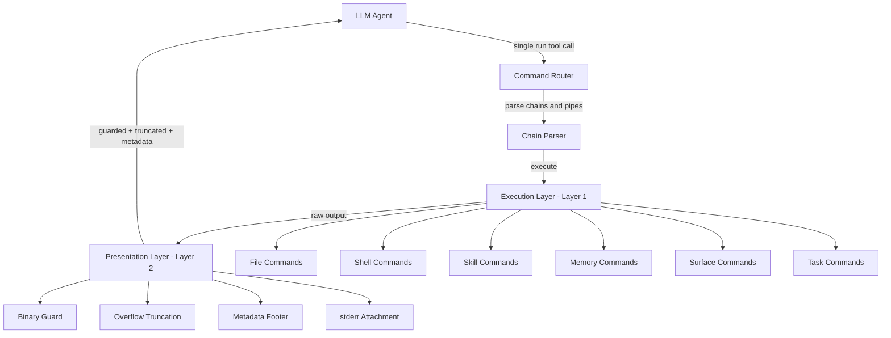
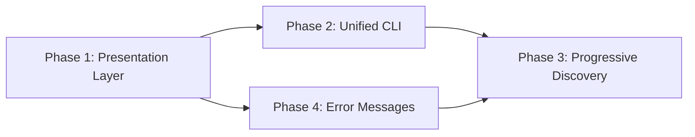

# *nix Agent Architecture Plan for ai-man

## Executive Summary

The Manus/agent-clip article identifies a fundamental insight: **LLMs are terminal operators**. Both Unix and LLMs operate on text streams, and CLI patterns are the densest tool-use representation in LLM training data. This plan adapts the article's four key innovations to ai-man's existing architecture.

## Current State Analysis

ai-man currently exposes **50+ individual tools** across 12 definition files to the LLM:

| Category | Tools | Token Cost |
|----------|-------|-----------|
| Core | 6 tools | ~600 tokens |
| File | 6 tools | ~700 tokens |
| Shell | 1 tool | ~100 tokens |
| Structured Dev | 16 tools | ~1400 tokens |
| Async Tasks | 8 tools | ~800 tokens |
| Surface | 8 tools | ~700 tokens |
| Skills | 7 tools | ~500 tokens |
| Desktop | 5 tools | ~350 tokens |
| Custom/Workspace | 4 tools | ~300 tokens |
| Recursive | 1 tool | ~150 tokens |
| MCP | 4 tools | ~300 tokens |
| Plugin-registered | Variable | Variable |

**Total: ~5,900+ schema tokens per conversation, before any plugin tools.**

### Current Problems the Article Addresses

1. **Tool selection overhead**: LLM must choose among 50+ tools with different schemas each turn. Cognitive load on "which tool?" instead of "what to accomplish?"
2. **Multi-step composition**: Reading a file, filtering, and counting requires 3 tool calls. Unix pipe does it in 1.
3. **Raw output dumping**: No binary guards, no truncation with exploration hints, no consistent metadata footer.
4. **Silent failures**: `run_command` returns stderr but error messages do not guide the agent toward recovery.
5. **Upfront context waste**: System prompt dumps all tool documentation regardless of task relevance.

---

## Architecture Overview



---

## Phase 1: Presentation Layer

**Goal**: Wrap all tool output through a presentation layer that protects the LLM from context pollution, binary garbage, and silent failures.

### 1A: Binary Guard

Add to `tool-executor.mjs` — after any tool returns, before sending to LLM:

```javascript
function guardBinary(output) {
    // Check for null bytes
    if (output.includes('\0')) return detectBinaryType(output);
    // Check UTF-8 validity and control char ratio
    const controlRatio = countControlChars(output) / output.length;
    if (controlRatio > 0.1) return detectBinaryType(output);
    return null; // Not binary
}
```

If binary detected: `[error] binary image file (182KB). Use: run_command({ command: "file photo.png" })` or similar guidance.

### 1B: Overflow Mode

Wrap all tool results through a truncation layer:

```javascript
function presentOutput(output, metadata) {
    const MAX_LINES = 200;
    const MAX_BYTES = 50 * 1024; // 50KB

    const lines = output.split('\n');
    if (lines.length <= MAX_LINES && output.length <= MAX_BYTES) {
        return output + formatFooter(metadata);
    }

    // Truncate and save full output
    const truncated = lines.slice(0, MAX_LINES).join('\n');
    const overflowPath = saveOverflow(output);

    return truncated +
        `\n\n--- output truncated (${lines.length} lines, ${formatBytes(output.length)}) ---\n` +
        `Full output: ${overflowPath}\n` +
        `Explore: run_command({ command: "cat ${overflowPath} | grep <pattern>" })\n` +
        `         run_command({ command: "cat ${overflowPath} | tail 100" })\n` +
        formatFooter(metadata);
}
```

### 1C: Metadata Footer

Append exit code and duration to every tool result:

```
[exit:0 | 45ms]
```

This gives the agent:
- **Success/failure signal** without parsing the output
- **Cost awareness** — long-running operations get called less

### 1D: stderr Always Attached

Current `shell-tools.mjs` already returns stderr, but the format is inconsistent. Normalize to always include stderr on failure:

```
[stderr] bash: pip: command not found
[exit:127 | 12ms]
```

### Files Modified
- `src/execution/tool-executor.mjs` — add `_presentResult()` wrapper around all tool returns
- New file: `src/execution/output-presenter.mjs` — binary guard, overflow, metadata, stderr logic
- `src/tools/shell-tools.mjs` — normalize exit code + stderr formatting

---

## Phase 2: Unified CLI Interface (Optional/Additive)

**Goal**: Add a single `run` tool that provides a unified CLI namespace for all internal commands, while keeping existing typed tools available.

> **Strategy**: This is *additive*, not replacement. The existing typed tools remain for backward compatibility and for contexts where structured input is valuable. The `run` command provides a CLI-style shortcut layer on top.

### 2A: Command Router

New module: `src/execution/command-router.mjs`

```javascript
const COMMANDS = {
    cat:     { handler: fileCommands.cat,    help: 'Read a text file. Usage: cat <path>' },
    ls:      { handler: fileCommands.ls,     help: 'List files. Usage: ls [path] [-r]' },
    write:   { handler: fileCommands.write,  help: 'Write file. Usage: write <path> [content] or stdin' },
    grep:    { handler: fileCommands.grep,   help: 'Filter lines. Usage: grep <pattern> [file] [-i] [-v] [-c]' },
    edit:    { handler: fileCommands.edit,    help: 'Edit file. Usage: edit <path> <search> <replace>' },
    exec:    { handler: shellCommands.exec,  help: 'Run shell command. Usage: exec <command>' },
    memory:  { handler: memoryCommands,      help: 'Memory ops. Usage: memory search|store|query' },
    skill:   { handler: skillCommands,       help: 'Skill ops. Usage: skill list|read|use <name>' },
    surface: { handler: surfaceCommands,     help: 'Surface ops. Usage: surface create|list|update' },
    task:    { handler: taskCommands,        help: 'Task ops. Usage: task spawn|list|status <id>' },
};
```

### 2B: Chain Parser

Support Unix-style composition operators:

```javascript
function parseChain(commandString) {
    // Parse: cmd1 | cmd2 && cmd3 || cmd4 ; cmd5
    // Returns: [{ command, operator }]
}
```

Four operators:
- `|` — pipe stdout to next command's stdin
- `&&` — execute next only if previous exit:0
- `||` — execute next only if previous failed
- `;` — execute next regardless

### 2C: Unified run Tool Definition

```javascript
{
    type: 'function',
    function: {
        name: 'run',
        description: dynamicCommandList(), // Generated at conversation start
        parameters: {
            type: 'object',
            properties: {
                command: {
                    type: 'string',
                    description: 'CLI command string. Supports pipes (|), chains (&&, ||), and sequences (;).'
                }
            },
            required: ['command']
        }
    }
}
```

### Example Conversions

| Current Approach | CLI Approach |
|---|---|
| `read_file({ path: "log.txt" })` then `execute_javascript({ code: "..." })` | `run({ command: "cat log.txt \| grep ERROR \| wc -l" })` |
| `list_files({ path: "src", recursive: true })` then `read_file(...)` | `run({ command: "ls src -r \| grep test" })` |
| `list_skills({})` then `read_skill({ name: "..." })` | `run({ command: "skill list && skill read route-management" })` |

### Files Created/Modified
- New: `src/execution/command-router.mjs` — command routing and dispatch
- New: `src/execution/chain-parser.mjs` — pipe and chain parsing
- New: `src/execution/cli-commands/` — individual command implementations wrapping existing handlers
- Modified: `src/execution/tool-executor.mjs` — register the `run` tool
- Modified: `src/tools/tool-definitions.mjs` — add `RUN_TOOL` export

---

## Phase 3: Progressive Discovery

**Goal**: Replace static system prompt tool documentation with progressive, on-demand help discovery.

### 3A: Dynamic Tool Description

Instead of documenting every tool in the system prompt, inject a compact command summary:

```
Available commands (use 'run({ command: "<cmd>" })' with no args for usage):
  cat     — Read a text file
  ls      — List files in workspace
  write   — Write content to a file
  grep    — Filter lines matching a pattern
  edit    — Apply search/replace edits
  exec    — Run a shell command
  memory  — Search or manage memory
  skill   — List, read, or use skills
  surface — Create and manage UI surfaces
  task    — Spawn and monitor background tasks
```

### 3B: Progressive --help Levels

**Level 0**: Command list in tool description (shown above) — injected once per conversation
**Level 1**: `run({ command: "memory" })` with no args returns usage:

```
memory: usage: memory search|store|query|promote|forget
  search <query> [-k keyword]  — search memories
  store <text> [-c category]   — store a memory
  query <query> [-l limit]     — query global memory
  promote <text>               — promote to global memory
  forget <id>                  — forget a memory
```

**Level 2**: `run({ command: "memory search" })` with missing args returns specific parameters:

```
memory search: usage: memory search <query> [-k keyword] [-l limit]
  <query>     — search text (required)
  -k keyword  — filter by keyword
  -l limit    — max results (default: 5)
```

### 3C: System Prompt Reduction

Current system prompt is ~20K characters. With progressive discovery:
- Remove per-tool documentation from system prompt
- Keep only behavioral rules, formatting guidelines, and the compact command list
- Estimated savings: ~8K-12K tokens per conversation

### Files Modified
- `src/core/system-prompt.mjs` — reduce tool documentation, add compact command list
- `src/execution/command-router.mjs` — implement help at each level
- Each CLI command module — implement `--help` and missing-args responses

---

## Phase 4: Navigational Error Messages

**Goal**: Every error message tells the agent exactly what to do next.

### Design Principle

```
Bad:  "Error: unknown command"
Good: "[error] unknown command: foo. Available: cat, ls, write, grep, edit, exec, memory, skill, surface, task"

Bad:  "Error: binary file"  
Good: "[error] cat: binary image file (182KB). Use: run({ command: 'exec file photo.png' }) to inspect"

Bad:  "Error: file not found"
Good: "[error] cat: file not found: config.yml. Use: run({ command: 'ls' }) to see available files"

Bad:  "Error: command failed"
Good: "[error] exec: exit 127. pip: command not found. Try: exec npx, exec yarn, or exec python3 -m pip"
```

### Implementation

Add an `AgentError` class that always contains:
1. What went wrong (factual)
2. What to do instead (actionable)

```javascript
class AgentError {
    constructor(command, what, suggestion) {
        this.message = `[error] ${command}: ${what}. ${suggestion}`;
    }
}
```

### Files Created/Modified
- New: `src/execution/agent-error.mjs` — navigational error class
- Modified: All CLI command modules — use `AgentError` instead of bare `Error`
- Modified: `src/tools/shell-tools.mjs` — wrap errors with suggestions
- Modified: `src/tools/file-tools.mjs` — wrap errors with suggestions

---

## Implementation Order and Risk Assessment



| Phase | Risk | Effort | Impact |
|-------|------|--------|--------|
| Phase 1: Presentation Layer | Low — additive wrapper, no breaking changes | Medium | High — prevents context pollution, binary garbage, silent failures |
| Phase 4: Error Messages | Low — improves existing error strings | Low | High — reduces agent recovery from 10 retries to 1-2 |
| Phase 2: Unified CLI | Medium — new subsystem, must coexist with typed tools | High | Medium — reduces tool selection overhead, enables composition |
| Phase 3: Progressive Discovery | Medium — changes system prompt contract | Medium | High — saves 8K-12K tokens per conversation |

### Recommended implementation order: P1 → P4 → P2 → P3

Phase 1 and 4 are pure improvements with no architectural risk. Phase 2 adds a parallel interface. Phase 3 depends on Phase 2 being stable.

---

## What We Are NOT Doing

Per the article's own "Boundaries and limitations":

1. **Not replacing typed tools** — We keep them for structured dev operations, surface creation, and MCP interactions where schema validation matters.
2. **Not removing safety** — The `run` command still goes through security checks, blocked patterns, and workspace path validation.
3. **Not making CLI the only interface** — It is additive. The LLM can still use `read_file()` directly if it prefers.

---

## Success Metrics

1. **Tool calls per task**: Measure average tool calls for common operations before/after CLI composition
2. **Error recovery speed**: Count retries after failures before/after navigational errors
3. **Context window usage**: Measure tokens consumed by tool schemas + outputs before/after presentation layer
4. **Binary incidents**: Zero instances of binary data reaching the LLM context
